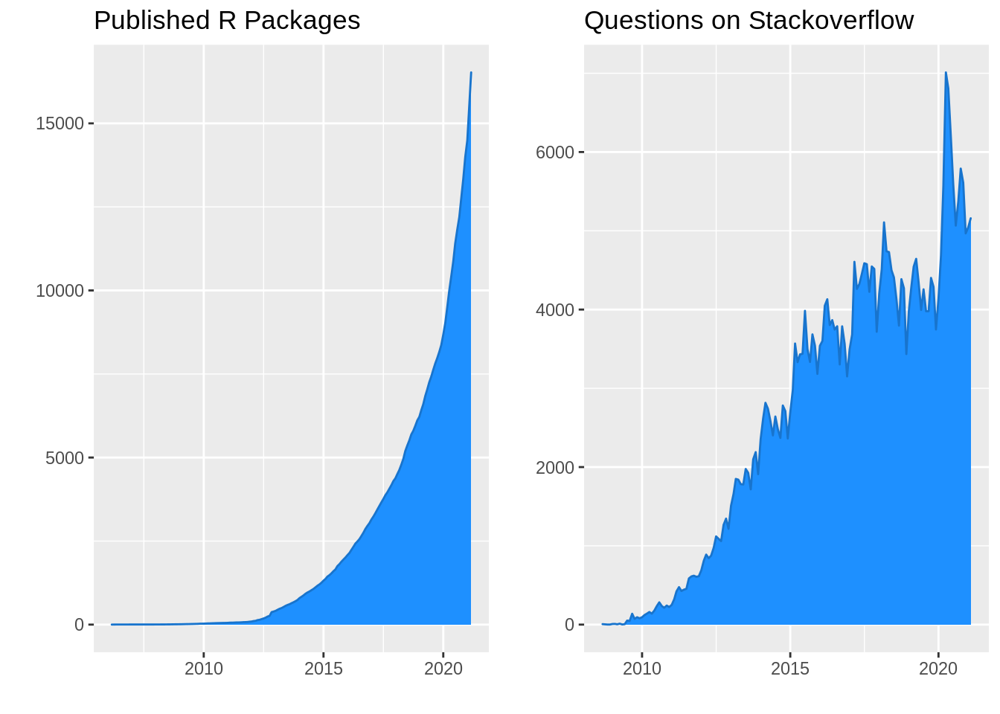
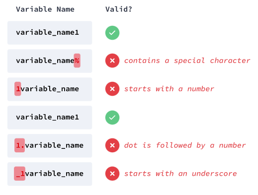

<style type="text/css">
  code{font-family: 'Fira Code', monospace;}
</style>

```{r setup, include=FALSE}
library(learnr)
#knitr::opts_chunk$set(engine = 'python')
knitr::opts_chunk$set(echo = FALSE)
```

<br>

::: {style="background-color: #34495E; color: white; padding: 20px"}
**En este capítulo aprenderás sobre:**

**1.** Los conceptos básicos de la sintaxis de programación en `R`.

**2.** El uso de variables y las reglas de nomenclatura.

**3.** Realizar cálculos usando operadores aritméticos.
:::

<br>

## `R`

`R` es un lenguaje de programación y un entorno para trabajar con datos. Es amado por los estadísticos y científicos de datos por su sintaxis de código expresivo y abundantes bibliotecas y herramientas externas, y funciona en todos los principales sistemas operativos.

Es la _navaja suiza_ para el análisis de datos y la computación estadística (¡y también puedes hacer algunos gráficos bonitos!). El lenguaje `R` se puede ampliar fácilmente con paquetes escritos por una gran y creciente comunidad de desarrolladores de todo el mundo. Puede encontrarlo prácticamente en cualquier lugar: lo utilizan instituciones académicas, empresas emergentes, corporaciones internacionales y muchos más.

Esto también se refleja al observar su **adopción**. En la siguiente figura puede ver un gran aumento tanto en las descargas como en la cantidad de paquetes disponibles a lo largo de los años:

<center>

{width="550"}

</center>

Estas son algunas de las características por las que R es más famoso:

-  **Visualización**: la creación de bellos gráficos y visualizaciones es una de sus mayores fortalezas. El lenguaje central ya proporciona un amplio conjunto de herramientas que se utilizan para trazar gráficos y para todo tipo de gráficos.

-  **Reproducibilidad**: a diferencia del software de hoja de cálculo, el código `R` no está acoplado a conjuntos de datos específicos y se puede reutilizar fácilmente en diferentes proyectos, incluso cuando se superan más de 1 millón de filas.

-  **Modelado avanzado**: `R` proporciona la base de código más grande y poderosa para el análisis de datos del mundo. La riqueza y profundidad de los modelos estadísticos disponibles es incomparable y crece día a día, gracias a la enorme comunidad de desarrolladores y contribuyentes de paquetes de código abierto.

-  **Automatización**: el código `R` también se puede utilizar para automatizar informes o realizar transformaciones de datos y cálculos de modelos. También se puede integrar en flujos de trabajo de producción automatizados, entornos de computación en la nube y sistemas de bases de datos modernos.

<br>

## 1. Lo Más Básico

-   Sintaxis básica de programación en `R`.
-   Los tipos de datos en `R`.
-   Los operadores aritméticos más comunes.

<br>

### Conceptos

-   En este curso trabajaremos con los siguientes tres **tipos de datos principales**:

1. Los **valores numéricos** son números. Aunque se pueden dividir en números enteros (_enteros_) y números con decimales (_dobles_), `R` convierte automáticamente entre estos subtipos si es necesario. Por lo tanto, colectivamente nos referiremos a ellos solo como valores numéricos.

2. Los **valores de caracteres** contienen contenido textual. También pueden ser letras, símbolos, espacios y números. Deben estar entre comillas, ya sea entre comillas simples `'___'` o comillas dobles `"___"`.

3. Los **valores lógicos** pueden ser `TRUE` o `FALSE`. También se les suele denominar _valores booleanos o binarios_. Debido a que un valor lógico solo puede ser `TRUE` o `FALSE`, se usan con mayor frecuencia para responder preguntas simples como "¿1 es mayor que 2?" o "¿Son más de las 3 en punto?". Este tipo de preguntas solo necesitan respuestas como `"Sí"` (`TRUE`) o `"No"` (`FALSE`). Es importante destacar que en `R` los valores lógicos distinguen entre mayúsculas y minúsculas, lo que significa que deben escribirse con letras mayúsculas.

-   Un [**valor literal**](https://www.webopedia.com/TERM/L/literal.html) es cualquier parte de una declaración o expresión que debe escribirse exactamente como debe interpretarse. En contraste, [una variable](https://www.webopedia.com/TERM/V/variable.html) es un nombre que puede representar diferentes valores durante la ejecución de un [programa](https://www.webopedia.com/TERM/P/program.html), mientras que [una constante](https://www.webopedia.com/TERM/C/constant.html) es un nombre que representa el mismo valor en todo el programa.

-   Un literal **no es un nombre**, **es el valor en sí mismo**, y puede ser un número, un caracter o una cadena de texto. Por ejemplo, en la expresión, `x = 3`, `x` es una variable y `3` es un literal.

-   `R` es **case-sensitive**, es decir, hace una diferencia entre mayúsculas y minúsculas: por ejemplo, `TRUE`, `FALSE`, `T` y `F` son los únicos literales lógicos correctos.

-   `R` permite **solo una instrucción** o línea válida **por línea de código**, por ejemplo, si ingresa dos literales lógicos en la misma línea, obtendrá un error.

<br>

### Sintaxis

-   Instalar librerías (una vez por librería).  

    ```{r eval=FALSE, echo=TRUE, highlight=TRUE}
    install.packages("package_name")
    ```

-   Cargar librerías (una vez por sesión).  

    ```{r eval=FALSE, echo=TRUE, highlight=TRUE}
    library(package_name)
    ```

-   Cargar datos (contenidos enn librerías).  

    ```{r eval=FALSE, echo=TRUE, highlight=TRUE}
    data(data_name)
    ```

-   Consultando la documentación.  

    ```{r eval=FALSE, echo=TRUE, highlight=TRUE}
    help(function_name)
    
    ?function_name
    
    apropos("name")
    ```

-   Comentarios. Se usa el caracter `#`.  

    ```{r eval=FALSE, echo=TRUE, highlight=TRUE}
    # Este es un comentario, se usa el caracter #
    ```

-   Asignación de variables. Se usa el operador `<-`.  

    ```{r eval=FALSE, echo=TRUE, highlight=TRUE}
    x <- 2
    ```

-   Importar datos. 

    ```{r eval=FALSE, echo=TRUE, highlight=TRUE}
    # Archivos Excel
    library(readxl)
    datos_excel <- read_xls("path/to/archive.xls")
    datos_excel <- read_xlsx("path/to/archive.xlsx")
    
    # Archivos CSV (coma separated values)
    datos_csv <- read.csv("path/to/archive.csv")
    datos_csv2 <- read.csv2("path/to/archive.csv2")
    
    # Archivos de texto
    datos_txt <- read.table("path/to/archive.txt")
    ```

-   Conocer/escoger el directorio de trabajo.

    ```{r eval=FALSE, echo=TRUE, highlight=TRUE}
    getwd()
    
    setwd("path/to/working_directory")
    ```
    
-   Conocer el tipo de dato.

    ```{r eval=FALSE, echo=TRUE, highlight=TRUE}
    class(object)
    ```
    
-   Literales y tipos de datos.

    **Lógico**: `TRUE` o `FALSE` (`T` o `F`).

    ```{r eval=FALSE, echo=TRUE, highlight=TRUE}
    # Para confirmar si es logical, entrega TRUE o FALSE
    is.logical(objeto)
    ```
    
    **Entero**: `125L`, `2L` y `10L` (números seguidos de la letra mayúscula `L` para indicar que son enteros).

    ```{r eval=FALSE, echo=TRUE, highlight=TRUE}
    # Para confirmar si es entero, entrega TRUE o FALSE
    is.integer(objeto)
    
    # Para convertir en entero
    as.integer(objeto)
    
    # Es posible transformar en entero los TRUE y FALSE.
    as.integer(TRUE)
    [1] 1
    as.integer(FALSE)
    [1] 0
    
    # No es posible transformar en entero una cadena de texto
    as.integer("Hola")
    [1] NA
    Warning message: 
      NAs introduced by coercion
    ```
    
    **Numérico**: `12.5`, `0.0314`, `0.00099` y `9.9e-3` (la notación científica está permitida usando la letra `e` o `E`). Es el tipo de dato usado por defecto.

    ```{r eval=FALSE, echo=TRUE, highlight=TRUE}
    # Para confirmar si es numérico, entrega TRUE o FALSE
    is.numeric(objeto)
    
    # Para convertir en numerico
    as.numeric(objeto)
    ```
    
    **Caracter**: `"Hola"`, `"12.5"`, `"Manzana"` y `"T"` (los caracteres están entre comillas o apóstrofos).

    ```{r eval=FALSE, echo=TRUE, highlight=TRUE}
    # Para confirmar si es caracter, entrega TRUE o FALSE
    is.character("cadena de caracteres")
    
    # Para convertir en caracter
    as.character(3.14)
    
    # Dos o mas valores de caracter pueden ser concatenados mediante
    paste("hola, ", "buenos días", "!")
    
    # Para extraer una subcadena de caracteres
    substr(x = "hola, buenos días!", start = 7, stop = 19)
    
    # Para reemplazar la primera ocurrencia de una cadena de caracteres
    sub(pattern = "buenos días", replacement = "buenas noches", x = "hola, buenos días!")
    
    # Más funciones las puede encontrar mediante
    help("sub")
    ```

-   Operadores aritméticos.

    **Multiplicación**: `5 * 5`.

    **División**: `5 / 5`.

    **Suma**: `5 + 5`.

    **Resta**: `5 - 5`.

<br>

## Ejercicios

::: {style="background-color: LightGray; padding: 20px"}  
**Uso de la Consola**

Escriba un programa que realice el cálculo `125 - 3`. Escriba su código en la consola de abajo y aprete `Run Code` para ejecutarlo. 

_Puede usar el botón `Hint` para ver la respuesta y el botón `Start Over` para borrar la consola e iniciar nuevamente._
:::

```{r ejer_2_1, exercise=TRUE, exercise.lines = 5}


```

```{r ejer_2_1-hint}
125 - 3
```

<br>

::: {style="background-color: LightGray; padding: 20px"}
**Valores Literales Lógicos**

Responda si las siguientes afirmaciones son correctas o no.
:::

```{r ejer_2_2}
quiz(caption = "",
     question("El literal \"true\" está representado por `True` en `R`.",
              answer("Verdadero"),
              answer("Falso", correct = TRUE),
              allow_retry = TRUE
     ),
     question("El literal \"false\" está representado por `F` o `FALSE` en `R`.",
              answer("Verdadero", correct = TRUE),
              answer("Falso"),
              allow_retry = TRUE
     ),
     question("No importa cómo escriba \"true\" y \"false\", es decir, si escribe `TRUE`, `True`, `tRue`, `false`, `R` los interpreta como literales lógicos.",
              answer("Verdadero"),
              answer("Falso", correct = TRUE),
              allow_retry = TRUE
     )
)
```

<br>

::: {style="background-color: LightGray; padding: 20px"}
**Valores Literales: Numéricos**

Responda las siguientes preguntas en orden y una respuesta por línea.

1.  _(Respuesta esperada: `TRUE` o `FALSE`)_ En `R`, el valor literal `1` es de tipo de datos lógicos.

2.  _(Respuesta esperada: valor literal correspondiente)_ De forma predeterminada, ¿cómo representará `R` este número `0.012`? Escríbalo en la consola y aprete `Run Code` para visualizarlo.
:::

```{r ejer_2_3, exercise=TRUE, exercise.lines = 5}
# Respuesta 1


# Respuesta 2

```

```{r ejer_2_3-hint}
# Respuesta 1
FALSE

# Respuesta 2
0.012
```

<br>

::: {style="background-color: LightGray; padding: 20px"}
**Valores Literales: Enteros**

Responda las siguientes preguntas en orden y una respuesta por línea.

1.  _(Respuesta esperada: `TRUE` o `FALSE`)_ Para representar un literal entero, el valor numérico está precedido por `I` (que significa entero).

2.  _(Respuesta esperada: valor literal correspondiente)_ Escriba en la consola este número, `125`, de manera apropiada para asegurarse de que `R` lo considere un literal entero.
:::

```{r ejer_2_4, exercise=TRUE, exercise.lines = 5}
# Respuesta 1


# Respuesta 2

```

```{r ejer_2_4-hint}
# Respuesta 1
FALSE

# Respuesta 2
125L
```

<br>

::: {style="background-color: LightGray; padding: 20px"}
**Valores Literales: Caracteres**

Responda las siguientes preguntas, según si está o no en acuerdo con las afirmaciones mostradas.
:::

```{r ejer_2_5}
quiz(caption = "",
     question("El valor literal `T` es un valor literal del tipo de datos de caracter.",
              answer("De acuerdo"),
              answer("En desacuerdo", correct = TRUE),
              allow_retry = TRUE
     ),
     question("Para representar un caracter literal, siempre debe estar precedido por comillas dobles y terminado por comillas simples (por ejemplo, `\"Buenos días\'`).",
              answer("De acuerdo"),
              answer("En desacuerdo", correct = TRUE),
              allow_retry = TRUE
     ),
     question("Una letra (por ejemplo, `\"A\"`) no es de un tipo de datos de caracter.",
              answer("De acuerdo"),
              answer("En desacuerdo", correct = TRUE),
              allow_retry = TRUE
     ),
     question("Un número es interpretado como tal por `R` solo si no está entre comillas simples/dobles.",
              answer("De acuerdo", correct = TRUE),
              answer("En desacuerdo"),
              allow_retry = TRUE
     )
)
```

<br>

::: {style="background-color: LightGray; padding: 20px"}
**Operadores Aritméticos: Expresión Simple**

La siguiente tabla contiene datos de un mercado de frutas. Las columnas incluidas son las siguientes:

-   Día de la semana (`day`).
-   Las frutas disponibles (`item`).
-   El número de frutas vendidas (`item sold`) y restante (`item available`).
-   El precio de compra (`purchase price`) y el precio de venta (`selling price`) de estas frutas.
-   Si un día es un día de suministro o no (`supply`).

<br>

+---+-----+--------+-----------+-----------+----------+-----------+----------+
|   | day | supply | item      | purchase\ | selling\ | item\     | item\    |
|   |     |        |           | price     | price    | available | sold     |
+:=:+:===:+:======:+:=========:+:=========:+:========:+:=========:+:========:+
| 1 | 1L  | TRUE   |  Apple    | 10.50     | 12.10    | 200L      | 0L       |
+---+-----+--------+-----------+-----------+----------+-----------+----------+
| 2 | 1L  | TRUE   |  Mangoes  | 21.15     | 24.90    | 50L       | 0L       |
+---+-----+--------+-----------+-----------+----------+-----------+----------+
| 3 | 1L  | TRUE   |  Lemon    | 3.20      | 4.99     | 500L      | 0L       |
+---+-----+--------+-----------+-----------+----------+-----------+----------+
| 4 | 2L  | FALSE  |  Apple    | 10.50     | 12.10    | 188L      | 12L      |
+---+-----+--------+-----------+-----------+----------+-----------+----------+
| 5 | 2L  | FALSE  |  Mangoes  | 21.15     | 24.90    | 47L       | 3L       |
+---+-----+--------+-----------+-----------+----------+-----------+----------+
| 6 | 2L  | FALSE  |  Lemon    | 3.20      | 4.99     | 476L      | 24L      |
+---+-----+--------+-----------+-----------+----------+-----------+----------+

<br>

Escriba las operaciones que respondan a las siguientes preguntas.

1.  La ganancia (precio de venta menos precio de compra) en la venta de un mango usando valores en las columnas de precio de compra y precio de venta.

2.  El ingreso total de los mangos vendidos el día 2 usando los valores en las columnas de artículo vendido y precio de venta.

3.  _(Respuesta esperada: `TRUE` o `FALSE`)_ El operador de multiplicación, en `R`, se escribe como `x`, por ejemplo, `3 x 4`.
:::

```{r ejer_2_6, exercise=TRUE, exercise.lines = 9}
# Respuesta 1


# Respuesta 2


# Respuesta 3

```

```{r ejer_2_6-hint}
# Respuesta 1
24.90 - 21.15

# Respuesta 2
3L * 24.90

# Respuesta 3
FALSE
```

<br>

::: {style="background-color: LightGray; padding: 20px"}
**Sintaxis de `R`**

1.  Escriba lo siguiente en la consola y verá que `R` tira un error:

      ```{style="background-color: #EAEDED; padding: 20px; border-radius: 25px; opacity: 1"}
        FALSE 
        TRUE FALSE
      ```
      
2.  ¿Por qué aparece el error?

3.  Corrija el error, escribiendo adecuadamente la secuencia de literales lógicos.
:::

```{r ejer_2_7, exercise=TRUE, exercise.lines = 9}
# Respuesta 1


# Respuesta 2


# Respuesta 3

```

```{r ejer_2_7-hint}
# Respuesta 1
FALSE 
TRUE FALSE

# Respuesta 2
"por que la segunda linea está incorecta, debe haber un comando ejecutable por línea"

# Respuesta 3
FALSE
TRUE
FALSE
```

<br>

## Recursos

-   [Tipos de datos](https://swcarpentry.github.io/r-novice-inflammation/13-supp-data-structures/) en `R`.
-   [Literales](https://www.webopedia.com/TERM/L/literal.html).
-   [Operadores aritméticos](https://stat.ethz.ch/R-manual/R-devel/library/base/html/Arithmetic.html) en `R`.

<br>

## 2. Expresiones Aritméticas y Variables

-   Realizar cálculos usando operadores aritméticos
-   Guardar valores usando variables
-   Actualizar variables
-   Trabajar con datos numéricos

<br>

### Conceptos

-   `R` usa las reglas de prioridad matemáticas al evaluar expresiones: primero se calculan los paréntesis, luego la exponenciación, luego la división y la multiplicación y, finalmente, la suma y la resta.

-   `R` usa las reglas de transformación de tipo de datos para determinar el tipo de datos de una expresión.

-   Las operaciones entre valores del mismo tipo de datos producen ese mismo tipo de datos.

-   Las operaciones entre valores de diferentes tipos de datos dan como resultado el tipo de datos más alto. De mayor a menor, los tipos de datos se clasifican como `Numeric`, `Integer`, `Logical`.

-   Por lo general, se desea almacenar datos en **variables** para poder trabajar con ellos más fácilmente. Las variables son como una caja con un nombre, y permiten la reutilización fácil de los objetos que contienen.

-   Hay algunas reglas que debe seguir al nombrar variables en `R`. Estas se ilustran en la siguiente figura:

<center>

{width="550"}

</center>

### Sintaxis

-  Operadores aritméticos avanzados.

    **Exponenciación**: `3^5`.

    **División entera**: `17 %/% 5`. Devuelve el entero.

    **Módulo**: `17 %% 5`. Devuelve el resto.

-  Variables.

    **Asignar un valor a una variable**:

    ```{r eval=FALSE, echo=TRUE, highlight=TRUE}
    value_1 <- 50 
    value_2 <- 5L
    ```

    **Asignar el resultado de una operación a una variable**:

    ```{r eval=FALSE, echo=TRUE, highlight=TRUE}
    total <- 5 + 5 
    average <- (5 + 5 + 5) / 3
    ```

    **Realizar operaciones usando variables**:

    ```{r eval=FALSE, echo=TRUE, highlight=TRUE}
    value_1 + value_2
    ```

-  Funciones integradas.

    **Tipo de datos de una variable**:

    ```{r eval=FALSE, echo=TRUE, highlight=TRUE}
    class(vector_1)
    ```

<br>

## Ejercicios

::: {style="background-color: LightGray; padding: 20px"}
**Revisando los Operadores Aritméticos Comunes**

Usando la tabla de datos de las frutas, escriba las operaciones que respondan a las siguientes preguntas.

<br>

+---+-----+--------+-----------+-----------+----------+-----------+----------+
|   | day | supply | item      | purchase\ | selling\ | item\     | item\    |
|   |     |        |           | price     | price    | available | sold     |
+:=:+:===:+:======:+:=========:+:=========:+:========:+:=========:+:========:+
| 1 | 1L  | TRUE   |  Apple    | 10.50     | 12.10    | 200L      | 0L       |
+---+-----+--------+-----------+-----------+----------+-----------+----------+
| 2 | 1L  | TRUE   |  Mangoes  | 21.15     | 24.90    | 50L       | 0L       |
+---+-----+--------+-----------+-----------+----------+-----------+----------+
| 3 | 1L  | TRUE   |  Lemon    | 3.20      | 4.99     | 500L      | 0L       |
+---+-----+--------+-----------+-----------+----------+-----------+----------+
| 4 | 2L  | FALSE  |  Apple    | 10.50     | 12.10    | 188L      | 12L      |
+---+-----+--------+-----------+-----------+----------+-----------+----------+
| 5 | 2L  | FALSE  |  Mangoes  | 21.15     | 24.90    | 47L       | 3L       |
+---+-----+--------+-----------+-----------+----------+-----------+----------+
| 6 | 2L  | FALSE  |  Lemon    | 3.20      | 4.99     | 476L      | 24L      |
+---+-----+--------+-----------+-----------+----------+-----------+----------+

<br>

1.  El número total de mangos y limones disponibles en la tienda el día 2 utilizando los valores de la columna de artículos disponibles.

2.  La relación entre el precio de compra del limón y su precio de venta usando valores en las columnas de precio de compra y precio de venta.
:::

```{r ejer_2_8, exercise=TRUE, exercise.lines = 6}
# Respuesta 1


# Respuesta 2


```

```{r ejer_2_8-hint}
# Respuesta 1
47L + 476L

# Respuesta 2
3.20 / 4.99
```

<br>

::: {style="background-color: LightGray; padding: 20px"}
**Tratando con Operadores Aritméticos Avanzados**

Usando la tabla de datos de las frutas, escriba las operaciones que respondan a las siguientes preguntas.

<br>

+---+-----+--------+-----------+-----------+----------+-----------+----------+
|   | day | supply | item      | purchase\ | selling\ | item\     | item\    |
|   |     |        |           | price     | price    | available | sold     |
+:=:+:===:+:======:+:=========:+:=========:+:========:+:=========:+:========:+
| 1 | 1L  | TRUE   |  Apple    | 10.50     | 12.10    | 200L      | 0L       |
+---+-----+--------+-----------+-----------+----------+-----------+----------+
| 2 | 1L  | TRUE   |  Mangoes  | 21.15     | 24.90    | 50L       | 0L       |
+---+-----+--------+-----------+-----------+----------+-----------+----------+
| 3 | 1L  | TRUE   |  Lemon    | 3.20      | 4.99     | 500L      | 0L       |
+---+-----+--------+-----------+-----------+----------+-----------+----------+
| 4 | 2L  | FALSE  |  Apple    | 10.50     | 12.10    | 188L      | 12L      |
+---+-----+--------+-----------+-----------+----------+-----------+----------+
| 5 | 2L  | FALSE  |  Mangoes  | 21.15     | 24.90    | 47L       | 3L       |
+---+-----+--------+-----------+-----------+----------+-----------+----------+
| 6 | 2L  | FALSE  |  Lemon    | 3.20      | 4.99     | 476L      | 24L      |
+---+-----+--------+-----------+-----------+----------+-----------+----------+

<br>

1.  Suponiendo que el precio de venta del limón es $\$5$, ¿cuántos limones se venden si se informa $\$128$ como el costo total de venta de un día? Utilice el operador de división de enteros, `%/%`, para responder a esta pregunta.

2.  _(Respuesta esperada: `TRUE` o `FALSE`)_ El símbolo del operador del módulo es `%`.
:::

```{r ejer_2_9, exercise=TRUE, exercise.lines = 6}
# Respuesta 1


# Respuesta 2


```

```{r ejer_2_9-hint}
# Respuesta 1
128L %/% 5L

# Respuesta 2
FALSE
```

<br>

::: {style="background-color: LightGray; padding: 20px"}
**Usando Expresiones Aritméticas Complejas**

Usando la tabla de datos de las frutas, determine el costo total de la compra de todas las frutas el día 1.

<br>

+---+-----+--------+-----------+-----------+----------+-----------+----------+
|   | day | supply | item      | purchase\ | selling\ | item\     | item\    |
|   |     |        |           | price     | price    | available | sold     |
+:=:+:===:+:======:+:=========:+:=========:+:========:+:=========:+:========:+
| 1 | 1L  | TRUE   |  Apple    | 10.50     | 12.10    | 200L      | 0L       |
+---+-----+--------+-----------+-----------+----------+-----------+----------+
| 2 | 1L  | TRUE   |  Mangoes  | 21.15     | 24.90    | 50L       | 0L       |
+---+-----+--------+-----------+-----------+----------+-----------+----------+
| 3 | 1L  | TRUE   |  Lemon    | 3.20      | 4.99     | 500L      | 0L       |
+---+-----+--------+-----------+-----------+----------+-----------+----------+
| 4 | 2L  | FALSE  |  Apple    | 10.50     | 12.10    | 188L      | 12L      |
+---+-----+--------+-----------+-----------+----------+-----------+----------+
| 5 | 2L  | FALSE  |  Mangoes  | 21.15     | 24.90    | 47L       | 3L       |
+---+-----+--------+-----------+-----------+----------+-----------+----------+
| 6 | 2L  | FALSE  |  Lemon    | 3.20      | 4.99     | 476L      | 24L      |
+---+-----+--------+-----------+-----------+----------+-----------+----------+

<br>

1.  Escriba en la consola las siguientes operaciones.

    -   El costo total de comprar manzanas el día 1.
    -   El costo total de la compra de mangos el día 1.
    -   El costo total de comprar limones el día 1.

2.  Calcule el costo total de comprar todas las frutas el día 1, en una sola expresión.
:::

```{r ejer_2_10, exercise=TRUE, exercise.lines = 6}
# Respuesta 1


# Respuesta 2


```

```{r ejer_2_10-hint}
# Respuesta 1
0.50 * 200L
21.15 * 50L
3.20 * 500L

# Respuesta 2
2100 + 1057.5 + 1600
```

<br>

::: {style="background-color: LightGray; padding: 20px"}
**Manejo de las Reglas de Prioridad**

Usando la tabla de datos de las frutas, determine el costo de venta general previsto de todas las frutas el día 1.

<br>

+---+-----+--------+-----------+-----------+----------+-----------+----------+
|   | day | supply | item      | purchase\ | selling\ | item\     | item\    |
|   |     |        |           | price     | price    | available | sold     |
+:=:+:===:+:======:+:=========:+:=========:+:========:+:=========:+:========:+
| 1 | 1L  | TRUE   |  Apple    | 10.50     | 12.10    | 200L      | 0L       |
+---+-----+--------+-----------+-----------+----------+-----------+----------+
| 2 | 1L  | TRUE   |  Mangoes  | 21.15     | 24.90    | 50L       | 0L       |
+---+-----+--------+-----------+-----------+----------+-----------+----------+
| 3 | 1L  | TRUE   |  Lemon    | 3.20      | 4.99     | 500L      | 0L       |
+---+-----+--------+-----------+-----------+----------+-----------+----------+
| 4 | 2L  | FALSE  |  Apple    | 10.50     | 12.10    | 188L      | 12L      |
+---+-----+--------+-----------+-----------+----------+-----------+----------+
| 5 | 2L  | FALSE  |  Mangoes  | 21.15     | 24.90    | 47L       | 3L       |
+---+-----+--------+-----------+-----------+----------+-----------+----------+
| 6 | 2L  | FALSE  |  Lemon    | 3.20      | 4.99     | 476L      | 24L      |
+---+-----+--------+-----------+-----------+----------+-----------+----------+

<br>

1.  Escriba en el editor de código las siguientes operaciones:

    -   El costo de venta previsto de las manzanas el día 1.
    -   El costo de venta previsto de los mangos el día 1.
    -   El costo de venta previsto de los limones el día 1.

2.  Calcule el costo de venta global previsto de todas las frutas el día 1.
:::

```{r ejer_2_11, exercise=TRUE, exercise.lines = 6}
# Respuesta 1


# Respuesta 2


```

```{r ejer_2_11-hint}
# Respuesta 1
12.10 * 200
24.90 * 50
4.99 * 500

# Respuesta 2
12.10 * 200 + 24.90 * 50 + 4.99 * 500
```

<br>

::: {style="background-color: LightGray; padding: 20px"}
**Identificación del Tipo de Datos**

Responda las siguientes preguntas.
:::

```{r ejer_2_12}
quiz(caption = "",
     question("¿Cuál es el tipo de dato de la siguiente expresión: `2 * 2 * 2`?",
              answer("numérico", correct = TRUE),
              answer("entero"),
              answer("lógico"),
              allow_retry = TRUE
     ),
     question("¿Cuál es el tipo de la siguiente expresión: `2L * 2L * 2`?",
              answer("numérico", correct = TRUE),
              answer("entero"),
              answer("lógico"),
              allow_retry = TRUE
     ),
     question("¿Cuál es el tipo de la siguiente expresión: `2L * 2L * 2L`?",
              answer("numérico"),
              answer("entero", correct = TRUE),
              answer("lógico"),
              allow_retry = TRUE
     )
)
```

<br>

::: {style="background-color: LightGray; padding: 20px"}
**Manejo de Variables con Reglas de Nomenclatura**

Usando reglas de nomenclatura, responda `Verdadero` si el nombre de la variable es válido y `Falso` en caso contrario.
:::

```{r ejer_2_13}
quiz(caption = "",
     question("`.2var`",
              answer("Verdadero"),
              answer("Falso", correct = TRUE),
              allow_retry = TRUE
     ),
     question("`numberOfFruit`",
              answer("Verdadero", correct = TRUE),
              answer("Falso"),
              allow_retry = TRUE
     ),
     question("`variable de manzana`",
              answer("Verdadero"),
              answer("Falso", correct = TRUE),
              allow_retry = TRUE
     ),
     question("`\"var\"`",
              answer("Verdadero"),
              answer("Falso", correct = TRUE),
              allow_retry = TRUE
     ),
     question("`edad20+`",
              answer("Verdadero"),
              answer("Falso", correct = TRUE),
              allow_retry = TRUE
     )
)
```

<br>

::: {style="background-color: LightGray; padding: 20px"}
**Actualizar Variables**

Usando la tabla de datos de las frutas, determine la utilidad total.

<br>

+---+-----+--------+-----------+-----------+----------+-----------+----------+
|   | day | supply | item      | purchase\ | selling\ | item\     | item\    |
|   |     |        |           | price     | price    | available | sold     |
+:=:+:===:+:======:+:=========:+:=========:+:========:+:=========:+:========:+
| 1 | 1L  | TRUE   |  Apple    | 10.50     | 12.10    | 200L      | 0L       |
+---+-----+--------+-----------+-----------+----------+-----------+----------+
| 2 | 1L  | TRUE   |  Mangoes  | 21.15     | 24.90    | 50L       | 0L       |
+---+-----+--------+-----------+-----------+----------+-----------+----------+
| 3 | 1L  | TRUE   |  Lemon    | 3.20      | 4.99     | 500L      | 0L       |
+---+-----+--------+-----------+-----------+----------+-----------+----------+
| 4 | 2L  | FALSE  |  Apple    | 10.50     | 12.10    | 188L      | 12L      |
+---+-----+--------+-----------+-----------+----------+-----------+----------+
| 5 | 2L  | FALSE  |  Mangoes  | 21.15     | 24.90    | 47L       | 3L       |
+---+-----+--------+-----------+-----------+----------+-----------+----------+
| 6 | 2L  | FALSE  |  Lemon    | 3.20      | 4.99     | 476L      | 24L      |
+---+-----+--------+-----------+-----------+----------+-----------+----------+

<br>

1.  Asigne las siguientes expresiones a las variables asociadas:

    -   Almacene el costo total de la compra de todas las frutas el día 1 en una variable llamada `total_purchase_cost`.
    -   Almacene las ventas totales previstas de todas las frutas el día 1 en una variable llamada `total_selling_cost`.

2.  Calcule el beneficio total haciendo `total_selling_cost - total_purchase_cost`. Almacene esta expresión en una variable denominada `profit_1`.
:::

```{r ejer_2_14, exercise=TRUE, exercise.lines = 6}
# Respuesta 1


# Respuesta 2


```

```{r ejer_2_14-hint}
# Respuesta 1
total_purchase_cost <- 10.50 * 200L + 21.15 * 50L + 3.20 * 500L
total_purchase_cost

total_selling_cost <- 12.10 * 200 + 24.90 * 50 + 4.99 * 500
total_selling_cost

# Respuesta 2
profit_1 <- total_selling_cost - total_purchase_cost
profit_1
```

<br>

::: {style="background-color: LightGray; padding: 20px"}
**Identificación del Tipo de Datos de las Variables**

Escriba su respuesta a las siguientes preguntas en la consola.

1.  Determine el tipo de datos de la variable `total_purchase_cost`. Almacene la salida en la variable `q_1`.

2.  Determine el tipo de datos de la variable `total_selling_cost`. Almacene la salida en la variable `q_2`.

3.  Determine el tipo de datos de la variable `profit_1`. Almacene la salida en la variable `q_3`.
:::

```{r ejer_2_15, exercise=TRUE, exercise.lines = 9}
# Respuesta 1


# Respuesta 2


# Respuesta 3


```

```{r ejer_2_15-hint}
# Respuesta 1
q_1 <- class(total_purchase_cost)
q_1

# Respuesta 2
q_2 <- class(total_selling_cost)
q_2

# Respuesta 3
q_3 <- class(profit_1)
q_3
```

<br>

## Recursos

-   [Notas sobre nombrar variables en `R`](https://www.r-bloggers.com/2014/07/consistent-naming-conventions-in-r/).

<br>

## 3. Expresiones Lógicas

-   Realizar cálculos usando operadores relacionales.
-   Realizar cálculos usando operadores lógicos.
-   Cómo trabajar con expresión lógicas.

<br>

### Conceptos

-   Los **operadores relacionales** se utilizan para comparar dos valores. El resultado de estas operaciones es siempre un valor lógico `TRUE` o `FALSE`.

-   Los **operadores lógicos** se utiliza para comprobar si varias declaraciones son `VERDADERAS` al mismo tiempo. Existen dos variantes en `R`, la _forma corta_ que realiza comparaciones elementoo a elemento, y la _forma larga_ que evalúa de izquierda a derecha examinando solo el primer elemento. La forma larga es apropiada para programar el flujo de control y normalmente se prefiere en las cláusulas `if`.

### Sintaxis

- Operadores relacionales. 

    **Menor que**: `5 < 6`.

    **Mayor que**: `6 > 5`.

    **Menor o igual que**: `5 <= 5`.

    **Mayor o igual que**: `6 >= 6`.

    **Igual a**: `5 == 5`.

    **Distinto a**: `5 != 6`.

-  Operadores lógicos.

    **Logical NOT**: `!TRUE`.

    **Short Logical AND**: `&`.

    **Long Logical AND**: `&&`.

    **Short Logical OR**: `|`.

    **Long Logical OR**: `||`.

<br>

## Ejercicios

::: {style="background-color: LightGray; padding: 20px"}
**Revisando Literales Lógicos**

Responda si las siguientes afirmaciones son correctas o no.
:::

```{r ejer_2_16}
quiz(caption = "",
     question("El literal \"false\" está representado por `False` en `R`.",
              answer("Verdadero"),
              answer("Falso", correct = TRUE),
              allow_retry = TRUE
     ),
     question("El literal \"true\" está representado por `T` o `TRUE` en `R`.",
              answer("Verdadero", correct = TRUE),
              answer("Falso"),
              allow_retry = TRUE
     ),
     question("No importa cómo escriba \"true\" y \"false\", es decir, si escribe `FALSE`, `False`, `fAlse`, `true` - `R` los interpreta como literales lógicos.",
              answer("Verdadero"),
              answer("Falso", correct = TRUE),
              allow_retry = TRUE
     )
)
```

<br>

::: {style="background-color: LightGray; padding: 20px"}
**Operadores Relacionales**

Escriba las operaciones que respondan a las siguientes preguntas utilizando el conjunto de datos de las frutas.

<br>

+---+-----+--------+-----------+-----------+----------+-----------+----------+
|   | day | supply | item      | purchase\ | selling\ | item\     | item\    |
|   |     |        |           | price     | price    | available | sold     |
+:=:+:===:+:======:+:=========:+:=========:+:========:+:=========:+:========:+
| 1 | 1L  | TRUE   |  Apple    | 10.50     | 12.10    | 200L      | 0L       |
+---+-----+--------+-----------+-----------+----------+-----------+----------+
| 2 | 1L  | TRUE   |  Mangoes  | 21.15     | 24.90    | 50L       | 0L       |
+---+-----+--------+-----------+-----------+----------+-----------+----------+
| 3 | 1L  | TRUE   |  Lemon    | 3.20      | 4.99     | 500L      | 0L       |
+---+-----+--------+-----------+-----------+----------+-----------+----------+
| 4 | 2L  | FALSE  |  Apple    | 10.50     | 12.10    | 188L      | 12L      |
+---+-----+--------+-----------+-----------+----------+-----------+----------+
| 5 | 2L  | FALSE  |  Mangoes  | 21.15     | 24.90    | 47L       | 3L       |
+---+-----+--------+-----------+-----------+----------+-----------+----------+
| 6 | 2L  | FALSE  |  Lemon    | 3.20      | 4.99     | 476L      | 24L      |
+---+-----+--------+-----------+-----------+----------+-----------+----------+

<br>

1.  Verifique si la cantidad de manzanas vendidas es mayor que la cantidad de limones vendidos en la tienda el día 2 usando los valores de la columna del artículo vendido.

2.  Verifique si el precio de compra de las manzanas es igual al precio de compra de los mangos usando los valores de la columna del precio de compra.
:::

```{r ejer_2_17, exercise=TRUE, exercise.lines = 6}
# Respuesta 1


# Respuesta 2

```

```{r ejer_2_17-hint}
# Respuesta 1
12L > 24L

# Respuesta 2
10.50 == 21.15
```

<br>

::: {style="background-color: LightGray; padding: 20px"}
**Comparando Expresiones Aritméticas**

Determina si los costos totales de la manzana y el limón vendidos son iguales.

1.  Asigne las siguientes expresiones a las variables asociadas.

    -   Almacene el costo total de la manzana vendida el día 2 en una variable llamada `apple_sold`.
    -   Almacene el costo total del limón vendido el día 2 en una variable llamada `lemon_sold`.

2.  Compruebe si `apple_sold` es igual a `lemon_sold` usando el operador igual a `==`.

    -   Almacene el resultado en una variable llamada `logical_var`.
:::

```{r ejer_2_18, exercise=TRUE, exercise.lines = 6}
# Respuesta 1


# Respuesta 2

```

```{r ejer_2_18-hint}
# Respuesta 1
apple_sold <- 12.10 * 12L
apple_sold

lemon_sold <- 4.99 * 24L
lemon_sold

# Respuesta 2
logical_var <- apple_sold == lemon_sold
logical_var
```

<br>

::: {style="background-color: LightGray; padding: 20px"}
**Operadores Lógicos**

Escribe las operaciones que respondan a las siguientes preguntas.

1.  Escriba la operación que permite obtener `TRUE` OR `FALSE`.

2.  Escriba la operación que permite obtener `FALSE` AND `TRUE`.

3.  Escriba la operación que permite obtener NOT `FALSE`.
:::

```{r ejer_2_19, exercise=TRUE, exercise.lines = 9}
# Respuesta 1


# Respuesta 2


# Respuesta 3

```

```{r ejer_2_19-hint}
# Respuesta 1
TRUE || FALSE

# Respuesta 2
FALSE && TRUE

# Respuesta 3
!FALSE
```

<br>

::: {style="background-color: LightGray; padding: 20px"}
**Combinando Expresiones Lógicas**

Determinar si los costos totales de la manzana y el limón vendidos son los mismos.

1.  Asigne las siguientes expresiones a las variables asociadas.

    -   Almacene el costo total de la manzana vendida el día 2 en una variable llamada `apple_profit`.
    -   Almacene el costo total del mango vendido el día 2 en una variable llamada `mango_profit`.
    -   Almacene el costo total del limón vendido el día 2 en una variable llamada `lemon_profit`.

2.  Compruebe si `apple_profit` es menor o igual a `mango_profit` OR `apple_profit` es mayor que `lemon_profit`. Almacene el resultado en una variable llamada `logical_var`.
:::

```{r ejer_2_20, exercise=TRUE, exercise.lines = 6}
# Respuesta 1

# Respuesta 2

```

```{r ejer_2_20-hint}
# Respuesta 1
apple_profit <- 12.10 - 10.50
apple_profit

mango_profit <- 24.90 - 21.15
mango_profit

lemon_profit <- 4.99 - 3.20
lemon_profit

# Respuesta 2
logical_var <- apple_profit <= mango_profit || apple_profit > mango_profit
logical_var
```

<br>

## Recursos

-   [Operadores relacionales en `R`](https://stat.ethz.ch/R-manual/R-devel/library/base/html/Comparison.html).
-   [Operadores lógicos en `R`](https://stat.ethz.ch/R-manual/R-devel/library/base/html/Logic.html).

<br>