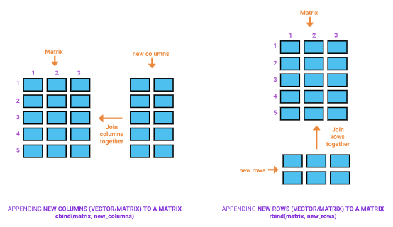
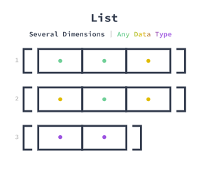

<style type="text/css">
  code{font-family: 'Fira Code', monospace;}
</style>


```{r setup, include=FALSE}
library(learnr)
#knitr::opts_chunk$set(engine = 'python')
knitr::opts_chunk$set(echo = FALSE)
recent_grads <- read.csv("data/recent_grads.csv")
```

<br>

::: {style="background-color: #34495E; color: white; padding: 20px"}
**En este capítulo aprenderás sobre:**

**1.** Crear una estructura de datos.

**2.** Indexar una estructura de datos.

**3.** Realizar operaciones sobre una estructura de datos.
:::

<br>

## 1. Vectores en `R`

En esta sección aprenderás:

-   Sobre vectores, estructuras de datos fundamentales en R.
-   Indexar vectores para extraer elementos específicos.
-   Aplicar funciones a vectores para realizar cálculos.

<br>

### Conceptos

-   **En `R` _todo_ es un vector**: siempre crea listas de valores, incluso cuando solo hay un valor en una lista. Estas listas se denominan _vectores_ y facilitan mucho el trabajo con datos.

-   **Vector**: estructura unidimensional para almacenar valores del mismo tipo. Es una colección de elementos del mismo tipo y la estructura de datos más básica en `R`.

-   Un **valor único** también se trata como un vector, un vector con un solo elemento en él. Como veremos a lo largo del curso, este concepto hace que `R` sea muy especial. Podemos manipular vectores y sus valores a través de muchas operaciones proporcionadas por `R`.

-   Una ventaja clave de los vectores es que podemos aplicar una operación (por ejemplo, una multiplicación) a todos sus valores a la vez en lugar de pasar por cada elemento individualmente. A esto se le llama **vectorización**.

    En la siguiente figura se puede apreciar una visualización gráfica de un vector.

<center>

{width="350"}

</center>

-   Los vectores **solo pueden contener elementos del mismo tipo de datos**. En este curso trabajaremos con los siguientes tres tipos de datos principales

-   `R` es un lenguaje de programación de **índice-1**, lo que significa que al primer elemento de un vector se le asigna una posición de uno.

-   Cuando se realizan operaciones con vectores de longitud desigual, `R` **recicla** los valores del vector más corto hasta que los dos vectores tienen la misma longitud.

<br>

### Sintaxis

-  Generar un vector (secuencia de números).

    **Use dos puntos (`:`) para generar un rango de valores**:

    ```{r eval=FALSE, echo=TRUE, highlight=TRUE}
    vector <- 1:4
    ```

    **Utilice la función `seq()` para generar una secuencia de valores siguiendo una regla**:

    ```{r eval=FALSE, echo=TRUE, highlight=TRUE}
    vector <- seq(from = 2, to = 10, by = 3)
    ```

    **Use la función `rep()` para generar valores repetidos**:

    ```{r eval=FALSE, echo=TRUE, highlight=TRUE}
    vector <- rep(4, times = 10)
    ```

-  Crear un vector.

    **Use la función `c()`**:

    ```{r eval=FALSE, echo=TRUE, highlight=TRUE}
    # Vector numerico
    numeric_vector <- c(14.1, 24.2, 34.3)
    
    # Vector entero
    integer_vector <- c(14L, 24L, 34L)
    
    # Vector lógico
    logical_vector <- c(TRUE, FALSE, TRUE, TRUE, FALSE)
    
    # Vector de carateres
    character_vector <- c("a", "hola", "TRUE", "3.14", "4L")
    
    # Conocer la longitud (cantidad de elementos) de un vector
    length(character_vector)
    
    # Combinar vectores (transforma al tipo de dato mas flexible)
    new_vector <- c(c(14.1, 24.2, 34.3), c("a", "hola", "TRUE", "3.14", "4L"))
    ```

-  Crear un vector con nombres.

    **Use la función `c()`**:

    ```{r eval=FALSE, echo=TRUE, highlight=TRUE}
    vector <- c("name_1" = 14, "name_2" = 24, "name_3" = 34)
    ```

    **Asignar atributo de nombre a un vector**:

    ```{r eval=FALSE, echo=TRUE, highlight=TRUE}
    names(vector) <- name_vector
    ```

-  Indexar vectores por posición.

    **Extraer un solo elemento**:

    ```{r eval=FALSE, echo=TRUE, highlight=TRUE}
    vector[1]
    ```

    **Extraer una rango de elementos**:

    ```{r eval=FALSE, echo=TRUE, highlight=TRUE}
    vector[3:7]
    ```

    **Extraer varios elementos**:

    ```{r eval=FALSE, echo=TRUE, highlight=TRUE}
    vector[c(2,5,7)]
    ```

    **Indice fuera de rango** (devuelve `NA`):

    ```{r eval=FALSE, echo=TRUE, highlight=TRUE}
    vector <- c(1, 2, 3, 4)
    vector[5]
    [1] NA
    ```

-  Indexar vectores usando valores lógicos.

    **Sea `logical_vector` un vector con `n` elementos `TRUE` y/o `FALSE`**:

    ```{r eval=FALSE, echo=TRUE, highlight=TRUE}
    numeric_vector[logical_vector]
    ```

-  Indexar vectores usando nombres.

    **Extraer un solo elemento**:

    ```{r eval=FALSE, echo=TRUE, highlight=TRUE}
    vector["name_2"]
    ```
    
    **Extraer varios elementos**:

    ```{r eval=FALSE, echo=TRUE, highlight=TRUE}
    vector[c("name_1", "name_2")]
    ```
    
-  Agregar elementos a un vector (transforma al tipo de dato mas flexible).

    **Un solo elemento**:

    ```{r eval=FALSE, echo=TRUE, highlight=TRUE}
    vector_1 <- c(5, 10, 15)
    vector_2 <- c(vector_1, "a")
    ```

    **Un vector a otro vector**:

    ```{r eval=FALSE, echo=TRUE, highlight=TRUE}
    vector_1 <- c(5, 10, 15)
    extra_values <- c("a", "hola", "TRUE", "3.14", "4L")
    vector_2 <- c(vector_1, extra_values)
    ```
    
-  Quitar elementos a un vector.

    **Un solo elemento**:

    ```{r eval=FALSE, echo=TRUE, highlight=TRUE}
    vector[-1]
    ```

    **Varios elementos**:

    ```{r eval=FALSE, echo=TRUE, highlight=TRUE}
    vector[c(-2, -5, -7)]
    ```
    
-  Realizar operaciones con vectores.

    **Suma, división o multiplicación de vectores**:

    ```{r eval=FALSE, echo=TRUE, highlight=TRUE}
    vector_1 + vector_2
    vector_1 / vector_2
    vector_1 * vector_2
    vector_1 + vector_2 * vector_3
    ```

    **Comparación de vectores** (elemento a elemento):

    ```{r eval=FALSE, echo=TRUE, highlight=TRUE}
    vector_1 < vector_2
    vector_1 <= vector_2
    vector_1 > vector_2
    vector_1 >= vector_2 
    vector_1 > vector_2 | vector_2 < vector_3
    vector_1 > vector_2 & vector_2 < vector_3
    ```

    **Operador `%in%`**:

    ```{r eval=FALSE, echo=TRUE, highlight=TRUE}
    vector_1 %in% vector_2
    ```

- Ordenar un vector. Puede usar el argumento `decreasing = TRUE` para ordenar en forma decreciente.

    ```{r eval=FALSE, echo=TRUE, highlight=TRUE}
    sort(vector)
    sort(vector, decreasing = TRUE)
    ```

<br>

## Ejercicios

::: {style="background-color: LightGray; padding: 20px"}
**Generación de vectores**

En este ejercicio, crearemos/generaremos algunos vectores.

1.  Cree un vector que contenga el valor 4 repetido diez veces usando la función `rep()`. Almacene el resultado en la variable `vector_1`.

3.  Cree un rango de valores que vaya desde 1 a 12. Almacene el resultado en la variable `vector_2`.

4.  Cree una secuencia de valores que vaya desde 2.0 a 5.50, con pasos de 0.25. Almacene el resultado en la variable `vector_3`.
:::

```{r ejer_3_1, exercise=TRUE, exercise.lines = 9}
# Respuesta 1


# Respuesta 2


# Respuesta 3


```

```{r ejer_3_1-hint}
# Respuesta 1
vector_1 <- rep(4, times = 10)
vector_1

# Respuesta 2
vector_2 <- 1:12
vector_2

# Respuesta 3
vector_3 <- seq(from = 2.0, 
                to = 5.50, 
                by = 0.25)
vector_3
```

<br>

::: {style="background-color: LightGray; padding: 20px"}
**Utilizando los operadore `&`, `|` y `%in%`**

1. Se le dan tres vectores `alfa`, `beta` y `gamma`. Utilice un operador lógico apropiado y verifique si `alfa` es mayor que `beta` y, al mismo tiempo, `gamma` es menor que `beta`.

2. Use el operador lógico apropiado y verifique si `alfa` es mayor que `beta` o `gamma` es menor que `beta`.

3. Está parado en el supermercado y necesita determinar qué puede marcar en su lista de compras. Para esto, use los vectores `lista_de_compras` y `cesta` dados.

    -   Utilice el operador adecuado y determine qué artículos de la lista de compras puede marcar en su lista en función de los artículos de su cesta.
:::

```{r ejer_3_1b, exercise=TRUE, exercise.lines =15}
alpha <- c(21, 12)
beta <- c(19, 34)
gamma <- c(19, 27)

lista_de_compras <- c("milk", "eggs", "tomatoes", "beer", "manner")
cesta <- c("bread","eggs","tomatoes")

# Respuesta 1


# Respuesta 2


# Respuesta 3


```

```{r ejer_3_1b-hint}
# Respuesta 1
alpha > beta & gamma < beta

# Respuesta 2
alpha > beta | gamma < beta

# Respuesta 3
shopping_list %in% basket
```

<br>

::: {style="background-color: LightGray; padding: 20px"}
**Crear un vector usando valores conocidos**

En este ejercicio, crearemos un vector para algunas clases del conjunto de datos dado en la siguiente tabla. Tenga presente que STEM significa *science, technology, engineering, and math*.

|        Class       | Exams | Homework | Projects |          |
|:------------------:|:-----:|:--------:|:--------:|:--------:|
|        Math        |   92  |    87    |    85    |   STEM   |
|      Chemistry     |   90  |    81    |    92    |   STEM   |
|       Writing      |   84  |    95    |    79    | non-STEM |
|         Art        |   95  |    86    |    93    | non-STEM |
|       History      |   77  |    85    |    90    | non-STEM |
|        Music       |   92  |    90    |    91    | non-STEM |
| Physical Education |   85  |    88    |    95    | non-STEM |

1.  Cree un vector entero llamado `math_grades` que contenga las calificaciones de los exámenes, tareas y proyectos para la clase de matemáticas, en ese orden.

2.  Cree un vector doble llamado `exam_grades` que contenga las calificaciones de los exámenes para todas las clases, en el orden en el que están en la tabla.

3.  Cree un vector lógico llamado `is_stem_classes` que contenga para cada clase `TRUE` si esta clase es una clase "STEM" y `FALSE` si es una clase "non-STEM".
:::

```{r ejer_3_2, exercise=TRUE, exercise.lines = 9}
# Respuesta 1


# Respuesta 2


# Respuesta 3


```

```{r ejer_3_2-hint}
# Respuesta 1
math_grades <- c(92L, 87L, 85L)
math_grades

# Respuesta 2
exam_grades <- c(92, 90, 84, 95, 77, 92, 85)
exam_grades

# Respuesta 3
is_stem_classes <- c(TRUE, TRUE, FALSE, FALSE, FALSE, FALSE, FALSE)
is_stem_classes
```

<br>

::: {style="background-color: LightGray; padding: 20px"}
**Indexación de vectores por posición**

Considere los vectores `math_grades` y `exam_grades` del ejemplo anterior.

1.  Escriba el código que indexa el primer elemento del vector `math_grades`. Almacene el resultado en la variable `math_exam_grade`.

2.  Escriba el código que selecciona elementos en la segunda, tercera y sexta posición del vector `exam_grades`. Almacene el resultado en la variable `desired_exam_grades`.

3.  Escriba el código para seleccionar del tercero al séptimo elementos del vector `exam_grades`. Almacene el resultado en la variable `non_stem_exam_grades`.
:::

```{r ejer_3_3, exercise=TRUE, exercise.lines = 12}
math_grades <- c(92L, 87L, 85L)
exam_grades <- c(92, 90, 84, 95, 77, 92, 85)

# Respuesta 1


# Respuesta 2


# Respuesta 3


```

```{r ejer_3_3-hint}
# Respuesta 1
math_exam_grade <- math_grades[1]
math_exam_grade

# Respuesta 2
desired_exam_grades <- exam_grades[c(2, 3, 6)]
desired_exam_grades

# Respuesta 3
non_stem_exam_grades <- exam_grades[c(3:7)]
non_stem_exam_grades
```

<br>

::: {style="background-color: LightGray; padding: 20px"}
**Indexación de vectores usando valores lógicos**

Considere el vector `is_stem_classes` dado.

1.  Cree un vector numérico llamado `homework_grades` que contenga las calificaciones de las tareas para todas las clases, siguiendo el el orden en el que aparecen en conjunto de datos.

2.  Escriba el código que selecciona las calificaciones de nuestras clases preferidas indexando `homework_grades` con `is_stem_classes`. Guarde el resultado en la variable `preffered_homework_grades`.
:::

```{r ejer_3_4, exercise=TRUE, exercise.lines = 8}
is_stem_classes <- c(TRUE, TRUE, FALSE, FALSE, FALSE, FALSE, FALSE)

# Respuesta 1


# Respuesta 2


```

```{r ejer_3_4-hint}
# Respuesta 1
homework_grades <- c(87, 81, 95, 86, 85, 90, 88)
homework_grades

# Respuesta 2
preffered_homework_grades <- homework_grades[is_stem_classes]
preffered_homework_grades
```

<br>

::: {style="background-color: LightGray; padding: 20px;"}
**Modificar elementos en un vector**

Considere los vectores `math_grades`, `exam_grades` e `is_stem_classes` construidos en los ejemplos anteriores.

1.  Reemplace el segundo elemento en `math_grades` por `80L`.

2.  Reemplace las calificaciones de examen de los cursos STEM, dadas mediante `exam_grades[is_stem_classes]`, con el valor `92`.
:::

```{r ejer_3_5, exercise=TRUE, exercise.lines = 10}
math_grades <- c(92L, 87L, 85L)
exam_grades <- c(92, 90, 84, 95, 77, 92, 85)
is_stem_classes <- c(TRUE, TRUE, FALSE, FALSE, FALSE, FALSE, FALSE)

# Respuesta 1


# Respuesta 2


```

```{r ejer_3_5-hint}
# Respuesta 1
math_grades[2] <- 80L
math_grades

# Respuesta 2
exam_grades[is_stem_classes] <- 92
exam_grades
```

<br>

::: {style="background-color: LightGray; padding: 20px"}
**Agregar elementos a un vector**

Considere el vector `is_stem_classes` construído en los ejemplos anteriores.

1.  Utilice la función `c()` para crear un vector llamado `extra_is_stem_classes` que contiene información extra sobre STEM, es decir, `TRUE`, `FALSE` y `FALSE`.

2.  Agregue los elementos en `extra_is_stem_classes` al final de `is_stem_classes` y use la función `c()`. Almacene el resultado en la variable `new_is_stem_classes_end`.

3.  Agregue los elementos en `extra_is_stem_classes` al comienzo de `is_stem_classes` y use la función `c()`. Almacene el resultado en la variable `new_is_stem_classes_start`.
:::

```{r ejer_3_6, exercise=TRUE, exercise.lines = 11}
is_stem_classes <- c(TRUE, TRUE, FALSE, FALSE, FALSE, FALSE, FALSE)

# Respuesta 1


# Respuesta 2


# Respuesta 3


```

```{r ejer_3_6-hint}
# Respuesta 1
extra_is_stem_classes <- c(TRUE, FALSE, FALSE)
extra_is_stem_classes

# Respuesta 2
new_is_stem_classes_end <- c(is_stem_classes, extra_is_stem_classes)
new_is_stem_classes_end

# Respuesta 3
new_is_stem_classes_start <- c(extra_is_stem_classes, is_stem_classes)
new_is_stem_classes_start
```

<br>

::: {style="background-color: LightGray; padding: 20px"}
**Eliminar elementos de un vector**

Considere los vectores `math_grades` y `exam_grades` construídos anteriormente.

1.  Escriba el código que eliminar el primer elemento del vector `math_grades`. Almacene el resultado en la variable `math_without_exam_grades`.

2.  Escriba el código que elimina las calificaciones de examenes inferiores a 90, es decir, el elemento en las posiciones tercera, quinta y séptima del vector `exam_grades`. Almacene el resultado en la variable `above_90_exam_grades`.
:::

```{r ejer_3_7, exercise=TRUE, exercise.lines = 9}
math_grades <- c(92L, 87L, 85L)
exam_grades <- c(92, 90, 84, 95, 77, 92, 85)

# Respuesta 1


# Respuesta 2


```

```{r ejer_3_7-hint}
# Respuesta 1
math_without_exam_grades <- math_grades[-1]
math_without_exam_grades

# Respuesta 2
above_90_exam_grades <- exam_grades[c(-3, -5, -7)]
above_90_exam_grades
```

<br>

::: {style="background-color: LightGray; padding: 20px"}
**Realización de operaciones con vectores**

Considere los vectores `exam_grades` y `homework_grades` construídos anteriormente.

1.  Construya el vector `project_grades`, que contenga las calificaciones de los proyectos para cada una de las asignaturas.

2.  Calcule la puntuación total para cada clase agregando los vectores `exam_grades`, `homework_grades` y `project_grades`. Almacene el resultado en la variable `class_scores_sum`.

3.  Calcule los puntajes promedio para cada clase dividiendo el vector `class_scores_sum` por 3. Almacene el resultado en la variable `class_scores_avg`.
:::

```{r ejer_3_8, exercise=TRUE, exercise.lines = 12}
exam_grades <- c(92, 90, 84, 95, 77, 92, 85)
homework_grades <- c(87, 81, 95, 86, 85, 90, 88)

# Respuesta 1


# Respuesta 2


# Respuesta 3


```

```{r ejer_3_8-hint}
# Respuesta 1
project_grades <- c(85, 92, 79, 93, 90, 91, 95)
project_grades

# Respuesta 2
class_scores_sum <- exam_grades + homework_grades + project_grades
class_scores_sum

# Respuesta 3
class_scores_avg <- class_scores_sum / 3
class_scores_avg
```

<br>

::: {style="background-color: LightGray; padding: 20px"}
**Reciclaje de vectores**

Considere los vectores `exam_grades`, `homework_grades` y `project_grades` construídos anteriormente. Note que `exam_grades` solo contiene los tres primeros elementos.

1.  Calcule la puntuación total para cada clase agregando los vectores `exam_grades`, `homework_grades` y `project_grades`. Almacene el resultado en la variable `class_scores_sum_recycled`.

2.  Calcule los puntajes promedio para cada clase dividiendo el vector `class_scores_sum_recycled` por 3. Almacene el resultado en la variable `class_scores_avg_recycled`.

3.  Compare los resultados de los vectores `class_scores_sum_recycled` y `class_scores_avg_recycled` obtenidos, con los de `class_scores_sum` y `class_scores_avg` obtenidos en el ejemplo anterior. ¿Por qué se produce la diferencia?
:::

```{r ejer_3_9, exercise=TRUE, exercise.lines = 13}
exam_grades <- c(92, 90, 84)
homework_grades <- c(87, 81, 95, 86, 85, 90, 88)
project_grades <- c(85, 92, 79, 93, 90, 91, 95)

# Respuesta 1


# Respuesta 2


# Respuesta 3


```

```{r ejer_3_9-hint}
# Respuesta 1
class_scores_sum_recycled <- exam_grades + homework_grades + project_grades
class_scores_sum_recycled

# Respuesta 2
class_scores_avg_recycled <- class_scores_sum_recycled / 3
class_scores_avg_recycled

# Respuesta 3
class_scores_sum
class_scores_avg
```

<br>

::: {style="background-color: LightGray; padding: 20px;"}
**Vectores con nombres**

Considere los vectores `exam_grades`, `homework_grades` y `project_grades` construídos anteriormente.

1.  Construya el vector `class_names` que contiene los nombres de las asignaturas.

2.  Use la función `names()` para nombrar elementos en el vector `exam_grades`. Para esto use el vector de nombres de clase, `class_names`.

3.  Use la función `names()` para nombrar elementos en el vector `homework_grades`, para esto use el vector de nombres de clase, `class_names`.

4.  Use la función `names()` para nombrar elementos en el vector `project_grades`, para esto use el vector de nombres de clase, `class_names`.
:::

```{r ejer_3_10, exercise=TRUE, exercise.lines = 16}
exam_grades <- c(92, 90, 84, 95, 77, 92, 85)
homework_grades <- c(87, 81, 95, 86, 85, 90, 88)
project_grades <- c(85, 92, 79, 93, 90, 91, 95)

# Respuesta 1


# Respuesta 2


# Respuesta 3


# Respuesta 4


```

```{r ejer_3_10-hint}
# Respuesta 1
class_names <- c("Math", "Chemistry", "Writing", "Art",
                 "History", "Music", "Physical Education")
class_names

# Respuesta 2
names(exam_grades) <- class_names
exam_grades

# Respuesta 3
names(homework_grades) <- class_names
homework_grades

# Respuesta 4
names(project_grades) <- class_names
project_grades
```

<br>

## Recursos

-   [Documentación sobre indexación de vectores en `R`](https://cran.r-project.org/doc/manuals/r-release/R-lang.html#Indexing).
-   [Documentación sobre la "regla de reciclaje" de `R`](https://cran.r-project.org/doc/manuals/r-release/R-intro.html#The-recycling-rule).

<br>

## 2. Matrices en `R`

En esta sección aprenderás:

-   Sobre las matrices, estructuras de datos fundamentales en `R`.
-   Indexar matrices para extraer elementos específicos.
-   Aplicar funciones a matrices para realizar cálculos.

<br>

### Conceptos

-   **Matriz**: estructura bidimensional para almacenar valores del mismo tipo.

    En la siguiente figura se puede apreciar una visualización gráfica de una matriz.

<br>

<center>

{width="350"}

</center>

<br>

-   `R` es un lenguaje de programación de **índice-1**, lo que significa que al primer elemento de una matriz se le asigna una posición de uno.

<br>

<center>

{width="550"}

</center>

<br>

-   Cómo se combinan vectores o matrices en `R`.

<br>

<center>

{width="550"}

</center>

<br>

-   Cómo calcular cantidades agregadas por columnas/filas en `R` sobre una estructura de datos bidimensional.

<br>

<center>

{width="550"}

</center>

<br>

### Sintaxis

-  Crear una matriz.

    **Reestructurar un vector** en una matriz usando la función `matrix()`:

    ```{r eval=FALSE, echo=TRUE, highlight=TRUE}
    matrix_1 <- matrix(1:12, ncol = 4, nrow = 3) 
    matrix_2 <- matrix(1:12, ncol = 4) 
    matrix_3 <- matrix(1:12, nrow = 3)
    ```
    
    **Combinar vectores o matrices por fila**:

    ```{r eval=FALSE, echo=TRUE, highlight=TRUE}
    matrix_4 <- rbind(matrix_1, matrix_2)
    matrix_5 <- rbind(vector_1, vector_2)
    matrix_6 <- rbind(vector_1, matrix_1)
    ```
    
    **Combinar vectores o matrices por columna**:

    ```{r eval=FALSE, echo=TRUE, highlight=TRUE}
    matrix_7 <- cbind(matrix_1, matrix_2)
    martix_8 <- cbind(vector_1, vector_2)
    matrix_9 <- cbind(vector_1, matrix_1)
    ```
    
-  Indexar matrices por elementos.

    **Extrae un solo elemento**:

    ```{r eval=FALSE, echo=TRUE, highlight=TRUE}
    matrix[2, 5] 
    matrix["row_name", "column_name"]
    ```
    
    **Extrae varios elementos**:

    ```{r eval=FALSE, echo=TRUE, highlight=TRUE}
    matrix[c(1, 2),c(1, 3)] 
    matrix[c("row_name_1", "row_name_2"), c("column_name_1", "column_name_2")]  
    matrix[row_name_condition, "column_name"]
    ```
    
-  Indexar matrices por filas y columnas.

    **Extraer una sola fila**:

    ```{r eval=FALSE, echo=TRUE, highlight=TRUE}
    matrix[1, ]
    matrix["row_name", ]
    ```
    
    **Extraer una sola columna**:

    ```{r eval=FALSE, echo=TRUE, highlight=TRUE}
    matrix[ , 2] 
    matrix[ , "column_name"]
    ```
    
    **Extraer varias filas o columnas**:

    ```{r eval=FALSE, echo=TRUE, highlight=TRUE}
    matrix[c("2, 3, 4"), ]
    matrix[c("row_name_1", "row_name_2", "row_name_3"), ]
    
    matrix[ , c("column_name_1", "column_name_2", "column_name_3")]    
    matrix[ , c("2, 3, 4")]
    ```
    
-  Calcular la suma/media de los valores en un vector o matriz.

    **Suma/Media de valores en un vector**:

    ```{r eval=FALSE, echo=TRUE, highlight=TRUE}
    sum(vector)
    mean(vector)
    ```
    
    **Suma/Media de valores en una matriz**:

    ```{r eval=FALSE, echo=TRUE, highlight=TRUE}
    sum(matrix[ ,"column"])
    mean(matrix["row", ])
    ```
    
    **Suma/Media de valores en una matriz por columna**:

    ```{r eval=FALSE, echo=TRUE, highlight=TRUE}
    colSums(matrix)
    colMeans(matrix)
    ```
    
    **Suma/Media de valores en una matriz por fila**:

    ```{r eval=FALSE, echo=TRUE, highlight=TRUE}
    rowSums(matrix)
    rowMeans(matrix)
    ```
    
-  Ranking de valores de un vector o subconjunto de una matriz.

    **Ranking de valores de un vector**:

    ```{r eval=FALSE, echo=TRUE, highlight=TRUE}
    rank(vector)
    ```
    
    **Ranking de valores de una matriz**:

    ```{r eval=FALSE, echo=TRUE, highlight=TRUE}
    rank(matrix[ ,"column"])
    rank(matrix["row", ])
    ```

-  Nombrar filas y columnas de una matriz

    **Asignar atributos de nombre a filas de una matriz**:

    ```{r eval=FALSE, echo=TRUE, highlight=TRUE}
    rownames(matrix) <- vector_row_names
    ```
    
    **Asignar atributos de nombre a las columnas de una matriz**:

    ```{r eval=FALSE, echo=TRUE, highlight=TRUE}
    colnames(matrix) <- vector_column_names
    ```
    
-  Eliminación de filas y columnas de una matriz

    **Eliminar un solo elemento**:

    ```{r eval=FALSE, echo=TRUE, highlight=TRUE}
    matrix[-1, -2]
    ```
    
    **Eliminar varios elementos**:

    ```{r eval=FALSE, echo=TRUE, highlight=TRUE}
    matrix[c(-2, -5, -7), ]
    ```
    
-  Otras operaciones.

    **Transpuesta de una matriz**:

    ```{r eval=FALSE, echo=TRUE, highlight=TRUE}
    t(matrix)
    ```

    **Deconstrucción de una matriz** (combina todos los vectores columna en un solo vector):

    ```{r eval=FALSE, echo=TRUE, highlight=TRUE}
    c(matrix)
    ```

<br>

## Ejercicios

::: {style="background-color: LightGray; padding: 20px"}
**Creación de una matriz Mediante la Reestructuración de un vector**

Usando las vectores `vector_1`, `vector_2` y `vector_3`:

1.  Cree la matriz denominada `matriz_1` reestructurando `vector_1` en dos filas y dos columnas.

2.  Cree la matriz denominada `matriz_2` reestructurando `vector_2` en cuatro filas y tres columnas.

3.  Cree la matriz denominada `matriz_3` reestructurando `vector_3` en tres filas y cinco columnas. Establezca el parámetro `byrow` en `TRUE` para reestructurar el vector por fila.
:::

```{r ejer_3_11, exercise=TRUE, exercise.lines = 17}
vector_1 <- c(1, 4, 5, 9)
vector_2 <- 1:12
vector_3 <- seq(from = 2.0, 
                to = 5.50, 
                by = 0.25)

# Respuesta 1


# Respuesta 2


# Respuesta 3


```

```{r ejer_3_11-hint}
# Respuesta 1
matrix_1 <- matrix(vector_1, 
                   nrow = 2) 
matrix_1

# Respuesta 2
matrix_2 <- matrix(vector_2, 
                   ncol = 3) 
matrix_2

# Respuesta 3
matrix_3 <- matrix(vector_3, 
                   nrow = 3, 
                   ncol = 5, 
                   byrow = TRUE) 
matrix_3
```

<br>

::: {style="background-color: LightGray; padding: 20px"}
**Crear una matriz combinando vectores**

Considere la siguiente tabla.

| University | world\_rank | quality\_of\_education | influence | broad\_impact | patents |
|:----------:|:-----------:|:----------------------:|:---------:|:-------------:|:-------:|
|   Harvard  |      1      |            1           |     1     |       1       |    3    |
|  Stanford  |      2      |            9           |     3     |       4       |    10   |
|     MIT    |      3      |            3           |     2     |       2       |    1    |
|  Cambridge |      4      |            2           |     6     |       13      |    48   |
|   Oxford   |      5      |            7           |     12    |       9       |    15   |
|  Columbia  |      6      |           13           |     13    |       12      |    4    |

1.  Construya un vector por cada columna usando la tabla anterior. Asigne a cada vector el nombre de la correspondiente columna.

2.  Cree una matriz, denominada `university_matrix`, a partir de los vectores de categoría mediante la función `cbind()`.
:::

```{r ejer_3_12, exercise=TRUE, exercise.lines = 23}
# Respuesta 1


# Respuesta 2


```

```{r ejer_3_12-hint}
# Respuesta 1
world_rank <- c(1, 2, 3, 4, 5, 6)
world_rank

quality_of_education <- c(1, 9, 3, 2, 7, 13)
quality_of_education

influence <- c(1, 3, 2, 6, 12, 13)
influence

broad_impact <- c(1, 4, 2, 13, 9, 12)
broad_impact

patents <- c(3, 10, 1, 48, 15, 4)
patents

# Respuesta 2
university_matrix <- cbind(world_rank, 
                           quality_of_education, 
                           influence, 
                           broad_impact, 
                           patents)
university_matrix
```

<br>

::: {style="background-color: LightGray; padding: 20px"}
**Nombrar filas y columnas de una matriz**

Usando la matriz creada en el ejemplo anterior:

1.  Nombra las filas de `university_matrix` usando el vector de nombres de universidades.

    -   Cree el vector de nombres de universidades que contenga los siguientes nombres, en este orden, `harvard`, `stanford`, `MIT`, `cambridge`, `oxford`, `columbia`.
    -   Asigne este vector de nombres de universidades a los nombres de cada fila usando `rownames(university_matrix)`.
:::

```{r ejer_3_13, exercise=TRUE, exercise.lines = 14}
world_rank <- c(1, 2, 3, 4, 5, 6)
quality_of_education <- c(1, 9, 3, 2, 7, 13)
influence <- c(1, 3, 2, 6, 12, 13)
broad_impact <- c(1, 4, 2, 13, 9, 12)
patents <- c(3, 10, 1, 48, 15, 4)
university_matrix <- cbind(world_rank, 
                           quality_of_education, 
                           influence, 
                           broad_impact, 
                           patents)

# Respuesta 1


```

```{r ejer_3_13-hint}
# Respuesta 1
rownames(university_matrix) <- c("harvard", "stanford", "MIT",
                                 "cambridge", "oxford", "columbia")
university_matrix
```

<br>

::: {style="background-color: LightGray; padding: 20px"}
**Indexando Matrices por columnas y filas**

Usando la matriz `university_matrix` creada anteriormente:

1.  Escriba un código para obtener el valor en la sexta fila (`columbia`) y tercera columna (`influence`) de `university_matrix`. Almacene el resultado en la variable `cell_columbia_influence`.

2.  Escriba un código para seleccionar elementos en la cuarta fila de `university_matrix`.  Almacene el resultado en la variable `vector_cambridge`.

3.  Escriba un código para seleccionar elementos en la primera columna de `university_matrix`. Almacene el resultado en la variable `vector_world_rank`.
:::

```{r ejer_3_14, exercise=TRUE, exercise.lines = 20}
world_rank <- c(1, 2, 3, 4, 5, 6)
quality_of_education <- c(1, 9, 3, 2, 7, 13)
influence <- c(1, 3, 2, 6, 12, 13)
broad_impact <- c(1, 4, 2, 13, 9, 12)
patents <- c(3, 10, 1, 48, 15, 4)
university_matrix <- cbind(world_rank, 
                           quality_of_education, 
                           influence, 
                           broad_impact, 
                           patents)

# Respuesta 1


# Respuesta 2


# Respuesta 3


```

```{r ejer_3_14-hint}
# Respuesta 1
cell_columbia_influence <- university_matrix[6, 3]
cell_columbia_influence

# Respuesta 2
vector_cambridge <- university_matrix[4, ]
vector_cambridge

# Respuesta 3
vector_world_rank <- university_matrix[ , 1]
vector_world_rank
```

<br>

::: {style="background-color: LightGray; padding: 20px"}
**Indexación de matrices usando vectores**

Usando la matriz `university_matrix` creada anteriormente:

1.  Cree un vector que contenga `TRUE` o `FALSE` según si la universidad es de Estados Unidos o no. Nombre este vector `usa_universities`.

2.  Escriba un código para indexar los valores en la primera, tercera y cuarta filas (`Harvard`, `MIT` y `Cambridge`) y la primera y cuarta columnas (`world_rank` y `broad_impact`) de `university_matrix`. Almacene el resultado en la variable `sub_matrix`.

3.  Escriba un código para indexar las universidades de Estados Unidos (`Harvard`, `Stanford`, `MIT` y `Columbia`) según su calificación en el ranking mundial (`world_rank`) y el número de epatentes. Almacene el resultado en la variable `usa_universities_rankings`.
:::

```{r ejer_3_15, exercise=TRUE, exercise.lines = 20}
world_rank <- c(1, 2, 3, 4, 5, 6)
quality_of_education <- c(1, 9, 3, 2, 7, 13)
influence <- c(1, 3, 2, 6, 12, 13)
broad_impact <- c(1, 4, 2, 13, 9, 12)
patents <- c(3, 10, 1, 48, 15, 4)
university_matrix <- cbind(world_rank, 
                           quality_of_education, 
                           influence, 
                           broad_impact, 
                           patents)

# Respuesta 1


# Respuesta 2


# Respuesta 3


```

```{r ejer_3_15-hint}
# Respuesta 1
usa_universities <- c(TRUE, TRUE, TRUE, FALSE, FALSE, TRUE)
usa_universities

# Respuesta 2
sub_matrix <- university_matrix[c(1, 3, 4), c(1, 4)]
sub_matrix

# Respuesta 3
usa_universities_rankings <- university_matrix[usa_universities, c(1, 5)]
usa_universities_rankings
```

<br>

::: {style="background-color: LightGray; padding: 20px"}
**Modificar elementos en una matriz**

Usando la matriz `university_matrix` y el vector `usa_universities` creados anteriormente:

1.  Reemplace el elemento en la cuarta fila (`cambridge`) y la quinta columna (`patents`) de `university_matrix` por el valor 3.

2.  Cambie la clasificación de las universidades de Estados Unidos (es decir, `Harvard`, `Stanford`, `MIT` y `Columbia`) al valor 2.
:::

```{r ejer_3_16, exercise=TRUE, exercise.lines = 20}
world_rank <- c(1, 2, 3, 4, 5, 6)
quality_of_education <- c(1, 9, 3, 2, 7, 13)
influence <- c(1, 3, 2, 6, 12, 13)
broad_impact <- c(1, 4, 2, 13, 9, 12)
patents <- c(3, 10, 1, 48, 15, 4)
university_matrix <- cbind(world_rank, 
                           quality_of_education, 
                           influence, 
                           broad_impact, 
                           patents)
rownames(university_matrix) <- c("harvard", "stanford", "MIT",
                                 "cambridge", "oxford", "columbia")
usa_universities <- c(TRUE, TRUE, TRUE, FALSE, FALSE, TRUE)

# Respuesta 1


# Respuesta 2


```

```{r ejer_3_16-hint}
# Respuesta 1
university_matrix[4, 5] <- 3
university_matrix

# Respuesta 2
university_matrix[usa_universities, ] <- 2
university_matrix
```

<br>

::: {style="background-color: LightGray; padding: 20px"}
**Agregar elementos a una matriz**

Considere el vector `california` que se muestra abajo, y el cual contiene la información de la Universidad de California para cada una de las variables de nuestra tabla de universidades.

1.  Agregue los elementos de la Universidad de California como una nueva fila de `university_matrix`, usando la función `rbind()`. Almacene el resultado en la variable `complete_university_matrix`.
:::

```{r ejer_3_17, exercise=TRUE, exercise.lines = 22}
california <- c(7, 5, 4, 7, 29)
world_rank <- c(1, 2, 3, 4, 5, 6)
quality_of_education <- c(1, 9, 3, 2, 7, 13)
influence <- c(1, 3, 2, 6, 12, 13)
broad_impact <- c(1, 4, 2, 13, 9, 12)
patents <- c(3, 10, 1, 48, 15, 4)
university_matrix <- cbind(world_rank, 
                           quality_of_education, 
                           influence, 
                           broad_impact, 
                           patents)
rownames(university_matrix) <- c("harvard", "stanford", "MIT",
                                 "cambridge", "oxford", "columbia")

# Respuesta 1


```

```{r ejer_3_17-hint}
# Respuesta 1
complete_university_matrix <- rbind(university_matrix, 
                                    california)
complete_university_matrix
```

<br>

::: {style="background-color: LightGray; padding: 20px"}
**Eliminar elementos de una matriz**

Considere la matriz `complete_university_matrix` creada en el ejemplo anterior.

1.  Escriba el código para eliminar la primera columna de `complete_university_matrix`. Almacene el resultado en la variable `university_matrix_wtho_first`.

2.  Escriba un código para para eliminar la segunda y la quinta columna donde `broad_impact` es menor que 10, `broad_impact <= 10`. Almacene el resultado en la variable `below_10_university_matrix`.
:::

```{r ejer_3_18, exercise=TRUE, exercise.lines = 22}
california <- c(7, 5, 4, 7, 29)
world_rank <- c(1, 2, 3, 4, 5, 6)
quality_of_education <- c(1, 9, 3, 2, 7, 13)
influence <- c(1, 3, 2, 6, 12, 13)
broad_impact <- c(1, 4, 2, 13, 9, 12)
patents <- c(3, 10, 1, 48, 15, 4)
university_matrix <- cbind(world_rank, 
                           quality_of_education, 
                           influence, 
                           broad_impact, 
                           patents)
rownames(university_matrix) <- c("harvard", "stanford", "MIT",
                                 "cambridge", "oxford", "columbia")
complete_university_matrix <- rbind(university_matrix, 
                                    california)

# Respuesta 1


# Respuesta 2


```

```{r ejer_3_18-hint}
# Respuesta 1
university_matrix_wtho_first <- complete_university_matrix[ , -1]
university_matrix_wtho_first

# Respuesta 2
below_10_university_matrix <- complete_university_matrix[broad_impact <= 10, c(-2, -5)]
below_10_university_matrix
```

<br>

::: {style="background-color: LightGray; padding: 20px"}
**Realizando operaciones con matrices**

Considere la matriz `complete_university_matrix` creada anteriormente.

1.  Calcule un ranking agregado para la Universidad de Harvard promediando los valores de cada categoría usando la función `mean()`. Almacene el resultado en la variable `harvard_scores_avg`.

2.  Calcule un ranking agregado para cada universidad promediando los valores de cada categoría usando la función `rowMeans()`. Almacene el resultado en la variable `university_scores_avg`.

3.  Calcule un ranking agregado para cada categoría promediando los valores de cada universidad usando la función `colMeans()`. Almacene el resultado en la variable `category_scores_avg`.
:::

```{r ejer_3_19, exercise=TRUE, exercise.lines = 25}
california <- c(7, 5, 4, 7, 29)
world_rank <- c(1, 2, 3, 4, 5, 6)
quality_of_education <- c(1, 9, 3, 2, 7, 13)
influence <- c(1, 3, 2, 6, 12, 13)
broad_impact <- c(1, 4, 2, 13, 9, 12)
patents <- c(3, 10, 1, 48, 15, 4)
university_matrix <- cbind(world_rank, 
                           quality_of_education, 
                           influence, 
                           broad_impact, 
                           patents)
rownames(university_matrix) <- c("harvard", "stanford", "MIT",
                                 "cambridge", "oxford", "columbia")
complete_university_matrix <- rbind(university_matrix, 
                                    california)

# Respuesta 1


# Respuesta 2


# Respuesta 3


```

```{r ejer_3_19-hint}
# Respuesta 1
harvard_scores_avg <- mean(complete_university_matrix["harvard", ])
harvard_scores_avg

# Respuesta 2
university_scores_avg <- rowMeans(complete_university_matrix)
university_scores_avg

# Respuesta 3
category_scores_avg <- colMeans(complete_university_matrix)
category_scores_avg
```

<br>

::: {style="background-color: LightGray; padding: 20px"}
**Puntuación y clasificación de universidades**

Ahora que hemos aprendido a combinar vectores en matrices, a extraer elementos y a realizar operaciones en matrices, analicemos los datos para decidir a qué universidad asistir.

Considere que para esto, conseguimos información sobre el valor de la matrícula en cada una de las universidades, y los almacenamos en el vector `tuition <- c(43280, 45000, 45016, 49350, 28450, 55161, 43176)`.

Ahora si, para responder a la pregunta, desarrollemos una puntuación para cada universidad que sea un agregado de los valores de cada una de las categorías disponibles. Es decir, clasificaremos las universidades para cada categoría de la que tenemos datos: `world_rank`, `quality_of_education`, `influence`, `broad_impact`, `patents`, y `tuition`.

Luego, podemos calcular una puntuación para cada universidad a partir de la suma de sus clasificaciones.

Para esto, usaremos la función `rank()`, junto con una expresión que indexa la matriz, para especificar la categoría por la que queremos clasificar las universidades. La función `rank()` devuelve un vector de valores numéricos. Por ejemplo, para clasificar las universidades por `quality_of_education`, escribimos `rank(university_matrix[,"quality_of_education"])` y guardamos el resultado en una variable con nombre `quality_of_education_rank`.

1.  Agregue la columna `tuition` a la matriz, y llámela `university_matrix_whole` .

2.  Utilice la función `rank()` para calcular una puntuación para cada universidad respecto a cada una de las variables disponibles. Llamelas `*_rank` donde `*` es el nombre de la columna usada.

3.  Construya una nueva matriz, llamada `ranks_university_matrix`, que contenga los vectores de ranking de cada universidad respecto a cada categoría.

4.  Calcule el promedio de los rankings de cada universidad en `ranks_university_matrix` usando la función `colMeans()`, y guardelos een la variable `university_matrix_avg`.

5.  ¿De acuerdo a los promedios calculados, en cuál universidad se matricularía?
:::

```{r ejer_3_20, exercise=TRUE, exercise.lines = 41}
california <- c(7, 5, 4, 7, 29)
world_rank <- c(1, 2, 3, 4, 5, 6)
quality_of_education <- c(1, 9, 3, 2, 7, 13)
influence <- c(1, 3, 2, 6, 12, 13)
broad_impact <- c(1, 4, 2, 13, 9, 12)
patents <- c(3, 10, 1, 48, 15, 4)
university_matrix <- cbind(world_rank, 
                           quality_of_education, 
                           influence, 
                           broad_impact, 
                           patents)
rownames(university_matrix) <- c("harvard", "stanford", "MIT",
                                 "cambridge", "oxford", "columbia")
complete_university_matrix <- rbind(university_matrix, 
                                    california)

# Respuesta 1


# Respuesta 2


# Respuesta 3


# Respuesta 4


# Respuesta 5


```

```{r ejer_3_20-hint}
# Respuesta 1
tuition <- c(43280, 45000, 45016, 49350, 28450, 55161, 43176)
tuition

university_matrix_whole <- cbind(complete_university_matrix, 
                                 tuition)
university_matrix_whole

# Respuesta 2
world_rank_rank <- rank(university_matrix_whole[ ,"world_rank"])
world_rank_rank

# Respuesta 3
quality_of_education_rank <- rank(university_matrix_whole[ ,"quality_of_education"])
quality_of_education_rank

influence_rank <- rank(university_matrix_whole[ ,"influence"])
influence_rank

broad_impact_rank <- rank(university_matrix_whole[ ,"broad_impact"])
broad_impact_rank

patents_rank <- rank(university_matrix_whole[ ,"patents"])
patents_rank

tuition_rank <- rank(university_matrix_whole[ ,"tuition"])
tuition_rank

ranks_university_matrix <- rbind(world_rank_rank, 
                                 quality_of_education_rank, 
                                 influence_rank, 
                                 broad_impact_rank, 
                                 patents_rank, tuition_rank)
ranks_university_matrix

# Respuesta 4
university_matrix_avg <- colMeans(ranks_university_matrix)
university_matrix_avg

# Respuesta 5
"De acuerdo a los promedios calculados, me matricularía en Harvard"
```

<br>

## Recursos

-   [Documentación sobre indexación de matrices en `R`](https://cran.r-project.org/doc/manuals/r-release/R-lang.html#Indexing).

<br>

## 3. Listas en `R`

En esta sección aprenderás:

-   A crear, agregar elementos y editar listas.
-   Indexar listas para extraer objetos y elementos específicos.

<br>

### Conceptos

-   **Listas**: estructura multidimensional para almacenar valores de cualquier tipo.

    En la siguiente figura se puede apreciar una visualización gráfica de una lista.

<br>

<center>

{width="350"}

</center>

<br>

-   En `R`, las listas son vectores especializados que pueden contener varios objetos. Los objetos pueden constar de diferentes estructuras de datos, incluidos elementos de datos únicos, vectores y matrices.

-   El almacenamiento de objetos en listas permite utilizar las funciones de `R` para realizar la misma operación en cada objeto de la lista.

-   Las listas de listas contienen varias listas como objetos. Cada lista contenida en una lista anidada puede, a su vez, contener objetos de cualquier tipo o estructura de datos.

<br>

### Sintaxis

-  Creación de Listas.

    **Crear una lista**:

    ```{r eval=FALSE, echo=TRUE, highlight=TRUE}
    new_list <- list("data scientist", c(50000,40000), "programming experience")
    ```
    
    **Asignar nombres a los objetos de la lista**:

    ```{r eval=FALSE, echo=TRUE, highlight=TRUE}
    # Utilizando un vector con los nombres
    names(new_list) <- c("job title", "salaries", "requirements")
    
    # De manera direta
    new_list <- list(job title = "data scientist",
                     salaries = c(50000,40000),
                     requirements = "programming experience")
    ```
    
-  Indexando Listas.

    **Devuelve una lista de los elementos seleccionados**:

    ```{r eval=FALSE, echo=TRUE, highlight=TRUE}
    new_list[1]
    new_list["job title"]
    new_list[c(1,3)]
    ```
    
    **Devuelve un solo elemento**:

    ```{r eval=FALSE, echo=TRUE, highlight=TRUE}
    new_list[[1]]
    new_list[["job title"]]
    new_list$"job title"
    ```
    
    **Devuelve un valor contenido en un elemento de lista**:

    ```{r eval=FALSE, echo=TRUE, highlight=TRUE}
    new_list[[c(1,3)]]
    ```
    
-  Manipular Listas.

    **Modificar elementos de lista**:

    ```{r eval=FALSE, echo=TRUE, highlight=TRUE}
    new_list[[1]] <- "junior data scientist"
    new_list[[c(2,1)]] <- 40000
    ```
    
    **Agregar elementos a listas**:

    ```{r eval=FALSE, echo=TRUE, highlight=TRUE}
    new_list[[4]] <- c("healthcare", "vacation")
    new_list[["benefits"]] <- c("healthcare", "vacation")
    ```
    
    **Eliminar objetos de listas**:

    ```{r eval=FALSE, echo=TRUE, highlight=TRUE}
    new_list[-3]
    ```
    
    **Combinar varias listas**:

    ```{r eval=FALSE, echo=TRUE, highlight=TRUE}
    new_list_2 <- c(new_list, new_list_1)
    ```
    
    **Crear una lista de listas (lista anidada)**:

    ```{r eval=FALSE, echo=TRUE, highlight=TRUE}
    new_list_3 <- list(new_list, new_list_1)
    ```
    
<br>

## Ejercicios

::: {style="background-color: LightGray; padding: 20px"}
**Listas: objetos que pueden contener varios tipos de datos**

Considere los vectores `harvard`, `stanford`, `MIT`, `cambridge`, `oxford` y `columbia` usados en los ejemplos anteriores.

1.  Usando la función `c()` cree un vector, llamado `category_names`, que contenga los nombres de las categorías: `"world_rank"`, `"quality_of_education"`, `"influence"`, `"broad_impact"`, y `"patents"`. Almacene el resultado en la variable `category_names`.

2.  Usando la función `rbind()` cree una matriz que combine los vectores `harvard`, `stanford`, `MIT`, `cambridge`, `oxford` y `columbia`. Almacene el resultado en la variable `university_matrix`.

3.  Modifique los nombres de las columnas de la matriz `university_matrix` usando la función `colnames()`.
:::

```{r ejer_3_21, exercise=TRUE, exercise.lines = 16}
harvard <- c(1, 1, 1, 1, 3)
stanford <- c(2, 9, 3, 4, 10)
MIT <- c(3, 3, 2, 2, 1)
cambridge <- c(4, 2, 6, 13, 48)
oxford <- c(5, 7, 12, 9, 15)
columbia <- c(6, 13, 13, 12, 4)

# Respuesta 1


# Respuesta 2


# Respuesta 3


```

```{r ejer_3_21-hint}
# Respuesta 1
category_names <- c("world_rank", "quality_of_education", "influence", "broad_impact", "patents")
category_names

# Respuesta 2
university_matrix <- rbind(harvard, stanford, MIT, cambridge, oxford, columbia)
university_matrix

# Respuesta 3
colnames(university_matrix) <- category_names
university_matrix
```

<br>

::: {style="background-color: LightGray; padding: 20px"}
**Creando una lista**

En este ejercicio crearemos algunas listas.

1.  Escriba el código necesario para almacenar los siguientes nombres de clubes en una lista denominada `university_clubs`: `"ballroom dancing"`, `"rugby"`, `"bird watching"`, `"pottery"`.

2.  Escriba el código necesario para almacenar los siguientes objetos en una lista llamada `mit_list`: `"MIT"`, `c(3, 3, 2, 2, 1)`, `TRUE`.

3.  Escriba el código necesario para crear una nueva lista llamada `mit_named_list` que modifica la lista anterior, `mit_list`, nombrando cada elemento de la lista, usando: `name`, `ranking`, `is_in_usa`.
:::

```{r ejer_3_22, exercise=TRUE, exercise.lines = 9}
# Respuesta 1


# Respuesta 2


# Respuesta 3


```

```{r ejer_3_22-hint}
# Respuesta 1
university_clubs <- list("ballroom dancing", "rugby", "bird watching", "pottery")
university_clubs

# Respuesta 2
mit_list <- list("MIT", c(3, 3, 2, 2, 1), TRUE)
mit_list

# Respuesta 3
mit_named_list <- list(name = "MIT", ranking = c(3, 3, 2, 2, 1), is_in_usa = TRUE)
mit_named_list
```

<br>

::: {style="background-color: LightGray; padding: 20px"}
**Anatomía de una lista**

Con los vectores `club_title`, `club_description`, `club_dues`, `meeting_days` y `meeting_times` proporcionados:

1.  Utilice la función `rbind()` para crear una matriz, llamada `club_meetings`, que contenga los días de la reunión y la hora de la reunión. Organice la matriz de modo que `meeting_days` sea la primera fila.

2.  Almacene los siguientes objetos `club_title`, `club_description`, `club_dues` y `club_meetings`, en este orden, en una lista llamada `chess_club`.
:::

```{r ejer_3_23, exercise=TRUE, exercise.lines = 12}
club_title <- c("Chess Club")
club_description <- c("Meets two nights a week for members to play chess. Snacks are provided.")
club_dues <- c(50, 20, 15)
meeting_days <- c("Monday", "Wednesday")
meeting_times <- c("6:00 pm", "8:00 pm")

# Respuesta 1


# Respuesta 2


```

```{r ejer_3_23-hint}
# Respuesta 1
club_meetings <- rbind(meeting_days, meeting_times)
club_meetings

# Respuesta 2
chess_club <- list(club_title, club_description, club_dues, club_meetings)
chess_club
```

<br>

::: {style="background-color: LightGray; padding: 20px"}
**Obtener/configurar nombres para enumerar objetos**

Considere la lista `chess_club` generada en el ejemplo anterior y el vector `chess_club_names` dado que contiene los nombres para los objetos de la lista `chess_club`.

1.  Utilice la función `names()` para asignar el vector `chess_club_names` como nombres a los elementos de la lista `chess_club`.
:::

```{r ejer_3_24, exercise=TRUE, exercise.lines = 13}
club_title <- c("Chess Club")
club_description <- c("Meets two nights a week for members to play chess. Snacks are provided.")
club_dues <- c(50, 20, 15)
meeting_days <- c("Monday", "Wednesday")
meeting_times <- c("6:00 pm", "8:00 pm")
club_meetings <- rbind(meeting_days, meeting_times)
chess_club <- list(club_title, club_description, club_dues, club_meetings)

chess_club_names <- c("club_title", "club_description", "club_dues", "club_meetings")

# Respuesta 1


```

```{r ejer_3_24-hint}
# Respuesta 1
names(chess_club) <- chess_club_names
chess_club
```

<br>

::: {style="background-color: LightGray; padding: 20px"}
**Indexando listas**

Considere la lista `chess_club` generada en el ejercicio anterior.

1.  Indexe la lista `chess_club` para devolver el cuarto objeto, es decir, la matriz de nombre `club_meetings`. Almacene el resultado en la variable `meeting_matrix`.

2.  Indexe el tercer objeto de la lista `chess_club`, es decir, el vector `club_dues`, para devolver el segundo elemento de ese objeto. Almacene el resultado en la variable `club_second_due`.
:::

```{r ejer_3_25, exercise=TRUE, exercise.lines = 14}
club_title <- c("Chess Club")
club_description <- c("Meets two nights a week for members to play chess. Snacks are provided.")
club_dues <- c(50, 20, 15)
meeting_days <- c("Monday", "Wednesday")
meeting_times <- c("6:00 pm", "8:00 pm")
club_meetings <- rbind(meeting_days, meeting_times)
chess_club <- list(club_title, club_description, club_dues, club_meetings)

# Respuesta 1


# Respuesta 2


```

```{r ejer_3_25-hint}
# Respuesta 1
meeting_matrix <- chess_club[[4]]
meeting_matrix

# Respuesta 2
club_second_due <- chess_club[[c(3,2)]]
club_second_due
```

<br>

::: {style="background-color: LightGray; padding: 20px"}
**Modificar elementos de la lista**

Considere la lista `chess_club` generada en anteriormente.

1.  Escriba el código necesario para reemplazar el tercer elemento de `club_dues` por el valor 5.

2.  Muestre el tercer elemento de `club_dues` en la lista `chess_club` para comprobar que el tercer elemento de `club_dues` ha cambiado.
:::

```{r ejer_3_26, exercise=TRUE, exercise.lines = 14}
club_title <- c("Chess Club")
club_description <- c("Meets two nights a week for members to play chess. Snacks are provided.")
club_dues <- c(50, 20, 15)
meeting_days <- c("Monday", "Wednesday")
meeting_times <- c("6:00 pm", "8:00 pm")
club_meetings <- rbind(meeting_days, meeting_times)
chess_club <- list(club_title, club_description, club_dues, club_meetings)

# Respuesta 1


# Respuesta 2


```

```{r ejer_3_26-hint}
# Respuesta 1
chess_club[[c(3, 3)]] <- 5
chess_club

# Respuesta 2
chess_club[[c(3, 3)]]
```

<br>

::: {style="background-color: LightGray; padding: 20px"}
**Agregar elementos a listas**

Considere el vector `first_years`, que contiene el número de miembros del club de ajedrez de primer año para los semestres de otoño y primavera del año pasado.

1.  Agregue el vector `first_years` como un objeto, del mismo nombre, al final de la lista `chess_club`. Utilice la sintaxis `chess_club[["object_name"]] <- object` para agregar el vector con un nombre asignado.

2.  Indexe `chess_club` para mostrar el número de estudiantes de primer año que participaron en el club de ajedrez durante el semestre de primavera del año pasado.
:::

```{r ejer_3_27, exercise=TRUE, exercise.lines = 9}
first_years <- c(12, 15)
names(first_years) <- c("fall", "spring")

# Respuesta 1


# Respuesta 2


```

```{r ejer_3_27-hint}
# Respuesta 1
chess_club[["first_years"]] <- first_years
chess_club

# Respuesta 2
chess_club$first_years[[2]]
```

<br>

::: {style="background-color: LightGray; padding: 20px"}
**Eliminar elementos de una lista**

Considera la lista `chess_club` generada en el ejemplo anterior

1.  Escriba el código necesario para eliminar el primer objeto de la lista, es decir, `chess_club`. Almacene el resultado en la variable `chess_club_without_1`.

2.  Escriba el código necesario para eliminar el objeto en la tercera y cuarta posición de la lista `chess_club`. Almacene el resultado en la variable `chess_club_without_34`.
:::

```{r ejer_3_28, exercise=TRUE, exercise.lines = 13}
chess_club <- list("club_title" = c("Chess Club"), 
                   "club_description" = c("Meets two nights a week for members to play chess. Snacks are provided."), 
                   "club_dues" = c(50, 20, 15), 
                   "club_meetings" = rbind(c("Monday", "Wednesday"), 
                                           c("6:00 pm", "8:00 pm")),
                   "first_years" = c("fall" = 12, "spring" = 15))

# Respuesta 1


# Respuesta 2


```

```{r ejer_3_28-hint}
# Respuesta 1
chess_club_without_1 <- chess_club[-1]
chess_club_without_1

# Respuesta 2
chess_club_without_34 <- chess_club[c(-3, -4)]
chess_club_without_34
```

<br>

::: {style="background-color: LightGray; padding: 20px"}
**Combinando listas**

Considere la lista `chess_club` creada anteriormente.

Por otro lado, tenemos información de dos nuevos clubs que queremos agregar a nuestra lista de clubs universitarios. Estos son `rugby_club` y `ballroom_dancing_club`. Las listas con su información se ven así:

``` {style="background-color: #EAEDED; padding: 20px; border-radius: 25px; opacity: 1"}
# rugby_club 

$club_title
[1] "Rugby Club"

$club_description
[1] "Plays matches against clubs from local universities"

$club_dues
[1] 80 60

$member_years_rugby
       first_yr second_yr third_yr fourth_yr
fall          8        12       13         2
spring        6        11       14         3


# ballroom_dancing_club

$club_title
[1] "Ballroom Dancing Club"

$club_description
[1] "Practices waltz, salsa, and tango dancing for competitions with local university dance teams"

$club_dues
[1] 150
```

1.  Cree cada una de las nuevas listas, para cada uno de los nuevos clubs. Utilice los nombres `rugby_club` y `ballroom_dancing_club` respectivamente.

2.  Cree una nueva lista, llamada `university_clubs` de acuerdo con lo siguiente:

    -   Esta lista debe contener las siguientes listas: `rugby_club`, `ballroom_dancing_club` y `chess_club`.
    -   En lugar de combinar los objetos de la lista en una sola lista, cree una lista de listas utilizando la función `list()`.
    -   Escriba el código necesario para que se nombre cada lista dentro de `university_clubs`. Conserve los nombres de la lista original.
:::

```{r ejer_3_29, exercise=TRUE, exercise.lines = 33, highlight=TRUE}
chess_club <- list("club_title" = c("Chess Club"), 
                   "club_description" = c("Meets two nights a week for members to play chess. Snacks are provided."), 
                   "club_dues" = c(50, 20, 15), 
                   "club_meetings" = rbind(c("Monday", "Wednesday"), 
                                           c("6:00 pm", "8:00 pm")),
                   "first_years" = c("fall" = 12, "spring" = 15))

# Respuesta 1


# Respuesta 2


```

```{r ejer_3_29-hint}
# Respuesta 1
rugby_club <- list("club_title" = c("Rugby Club"), 
                   "club_description" = c("Plays matches against clubs from local universities."), 
                   "club_dues" = c(80, 50), 
                   "member_years_rugby" = rbind("fall"   = c("first_yr"  = 8,
                                                             "second_yr" = 12,
                                                             "third_yr"  = 13,
                                                             "fourth_yr" = 2),
                                                "spring" = c("first_yr"  = 6,
                                                             "second_yr" = 11,
                                                             "third_yr"  = 14,
                                                             "fourth_yr" = 3)))
rugby_club

ballroom_dancing_club <- list("club_title" = c("Ballroom Dancing Club"), 
                              "club_description" = c("Practices waltz, salsa, and tango dancing for competitions with local university dance teams."), 
                              "club_dues" = 150)
ballroom_dancing_club

# Respuesta 2
university_clubs <- list(rugby_club = rugby_club, 
                         ballroom_dancing_club = ballroom_dancing_club, 
                         chess_club = chess_club)
university_clubs
str(university_clubs)
```

<br>

## Recursos

-   [Documentación sobre listas en `R`](https://cran.r-project.org/doc/manuals/r-patched/R-intro.html#Lists).

<br>

## 4. Data Frames en `R`

En esta sección aprenderás:

-   Qué es un data frame y cómo se relaciona con el análisis de datos.
-   Cómo conocer las diferentes características de un data frame.
-   Cómo filtrar y crear subconjuntos de datos en un data frame.

<br>

### Conceptos

-   Los **datos tabulares** son el formato más común utilizado por los científicos de datos. En `R`, las tablas se representan mediante _data frames_. Se pueden inspeccionar imprimiéndolos en la consola.

-   **Data frame**: estructura bidimensional para almacenar valores de cualquier tipo.

    En la siguiente figura se puede apreciar una visualización gráfica de un data frame.

<br>

<center>

{width="350"}

</center>

<br>

-   Los datos tabulares se organizan en filas, donde una fila representa una sola entidad y las columnas representan diferentes características de esta fila.

-   Los archivos Microsoft Excel, Google Sheets y CSV son formas comunes de ver los datos tabulares.

<br>

### Sintaxis

-  Crear un data frame.

    ```{r eval=FALSE, echo=TRUE, highlight=TRUE}
    df <- data.frame("column_name_1" = vector_1,
                     "column_name_2" = vector_2,
                     ...)
    ```

-  Importar un conjunto de datos. Use el argumento `stringsAsFactors = FALSE` para evitar que de manera automática la función `read.csv()` transforme en factores las distintas cadenas de caracteres, para cada columna del data frame.

    ```{r eval=FALSE, echo=TRUE, highlight=TRUE}
    df <- read.csv("name_of_file_with_data.csv", stringsAsFactors = FALSE)
    ```

-  Más información sobre columnas, tipo de datos y dimensiones de data frames.

    ```{r eval=FALSE, echo=TRUE, highlight=TRUE}
    # Examinar interactivamente el data frame
    View(df)
    
    # Revisar la estructura y tipos de datos en el data frame df
    str(df)
    
    # Visualizar las primeras n filas del data frame df
    head(df, n)
    
    # Visualizar las ultimas n filas del data frame df
    tail(df, n)
    
    # Obtener los valores únicos de una columna del data frame df
    unique(df$column_name)
    
    # Obtener dimensiones del data frame
    dim(df)
    
    # Obtener nombres de las columnas
    names(df)
    ```

-  Devuelve el número o filas o columnas de un data frame.

    ```{r eval=FALSE, echo=TRUE, highlight=TRUE}
    # Devuelve el número de filas del data frame df
    nrow(df)
    
    # Devuelve el número de columnas del data frame df
    ncol(df)
    length(df)
    ```

-  Seleccionar una columna de un data frame.

    ```{r eval=FALSE, echo=TRUE, highlight=TRUE}
    # Selecciona la 3a columna, como si fuera una matriz, devuelve un vector
    df[ , 3]
    
    # Selecciona la 3a columna, como si fuera una lista, devuelve un data frame
    df[3]
    
    # Selecciona la 3a columna, devuelve un vector
    df[[1]]
    
    # Selecciona la columna usando el nombre, devuelve un vector
    df[["column_name"]] 
    
    # Selecciona la columna usando el nombre, devuelve un vector
    df$column_name
    ```

-  Seleccionar varias columnas de un data frame.

    ```{r eval=FALSE, echo=TRUE, highlight=TRUE}
    # Selecciona la 1a y 3a columna, como si fuera una matriz, devuelve un data frame
    df[ , c(1, 3)]
    
    # Selecciona la 1a y 3a columna, como si fuera una lista, devuelve un data frame
    df[c(1, 3)]
    
    # Selecciona columnas usando nombres, como si fuera una matriz, devuelve un data frame
    df[ , c("column_name_1", "column_name_2")]
    
    # Selecciona columnas usando nombres, como si fuera una lista, devuelve un data frame
    df[c("column_name_1", "column_name_2")]
    ```

-  Eliminar columnas de un data frame.

    ```{r eval=FALSE, echo=TRUE, highlight=TRUE}
    # Elimina la 1a y 3a columna, como si fuera una matriz, devuelve un data frame
    df[ , -c(1, 3)]
    
    # Elimina la 1a y 3a columna, como si fuera una lista, devuelve un data frame
    df[-c(1, 3)]
    
    # Elimina columnas usando nombres, como si fuera una matriz, devuelve un data frame
    df[ , setdiff(names(df), c("column_name_1", "column_name_2"))]
    
    # Elimina columnas usando nombres, como si fuera una lista, devuelve un data frame
    df[setdiff(names(df), c("column_name_1", "column_name_2"))]
    ```

-  Filtrar filas de un data frame según condiciones. Recuerde usar los operadores booleanos vectoriales `&` y `|` para combinar condiciones. Las condiciones pueden contener los operadores aritméticos `<`, `>`, `<=`, `>=`, `==`, `!=`, o incluso funciones más complejas.

    ```{r eval=FALSE, echo=TRUE, highlight=TRUE}
    df[condition_1 & condition_2, ]
    
    subset(df, condition_1 & condition_2)
    ```

-  Agregar nuevas columnas a un data frame.

    ```{r eval=FALSE, echo=TRUE, highlight=TRUE}
    # Nuevo vector con tantos elementos como filas tenga el data frame df
    new_column <- c(...)
    
    new_data <- cbind(df, new_column)
    new_data <- data.frame(df, new_column)
    
    # Nuevo data_frame con tantos elementos como filas tenga el data frame df
    new_data_frame <- data.frame(...)
    
    new_data <- cbind(df, new_data_frame)
    new_data <- data.frame(df, new_data_frame)
    ```

-  Agregar nuevas filas a un data frame.

    ```{r eval=FALSE, echo=TRUE, highlight=TRUE}
    # Nuevo vector con tantos elementos como columnas tenga el data frame df
    new_row <- c(...)
    
    new_data <- rbind(df, new_row)
    
    # Nuevo data_frame con tantos elementos como filas tenga el data frame df
    new_data_frame <- data.frame(...)
    
    new_data <- rbind(df, new_data_frame)
    ```

- Ordenar de menor a mayor (ascendentemente) un data frame respecto a la columna `"column_name"`. Puede usar `decreasing = TRUE` para ordenar de mayor a menor (decrecientemente).

    ```{r eval=FALSE, echo=TRUE, highlight=TRUE}
    ordered_data <- df[order(df$column_name), ]
    ordered_data <- df[order(df$column_name, decreasing = TRUE), ]
    ```

- Resumir un data frame.

    ```{r eval=FALSE, echo=TRUE, highlight=TRUE}
    # Operaciones de agregación por columna, devuelven un valor
    mean(df$column_name)
    sd(df$column_name)
    max(df$column_name)
    min(df$column_name)
    sum(df$column_name)
    
    # Operaciones de agregación por columna con agrupamiento, devuelven un data frame
    aggregate(column_to_aggregate ~ column_to_grouping, data = df, FUN = mean)
    aggregate(column_to_aggregate ~ column_to_grouping, data = df, FUN = sd)
    aggregate(column_to_aggregate ~ column_to_grouping, data = df, FUN = min)
    aggregate(column_to_aggregate ~ column_to_grouping, data = df, FUN = max)
    aggregate(column_to_aggregate ~ column_to_grouping, data = df, FUN = sum)
    
    # Crear tablas de contingencia para resumir la frecuencia y distribución de los valores de una variable o de combinación de variables
    table(df$column_name_1)
    table(df$column_name_1, df$column_name_2)
    ```

- Realizar operaciones con/entre columnas de un data frame

    ```{r eval=FALSE, echo=TRUE, highlight=TRUE}
    # Operaciones aritméticas básicas, devuelven un vector de longitud igual a la del data frame df
    df$column_name_1 + df$column_name_2
    df$column_name_1 - df$column_name_2
    df$column_name_1 * df$column_name_2
    df$column_name_1 / df$column_name_2
    ```

<br>

## Ejercicios

::: {style="background-color: LightGray; padding: 20px"}
**Familiarizarse con los datos**

Utilizaremos los datos del archivo `recent_grads.csv` que tiene disponible.

1.  Usando la función `read.csv()` carge los datos y asignelos al objeto `recent_grads`. Visualice las primeras 15 filas del data frame.

2.  Utilice la función `str()` para echar un vistazo a los datos de `recent_grads`. Familiarícese con los datos antes de responder las siguientes preguntas.

3.  Utilice la función `names()` para obtener los nombres de las columnas de `recent_grads`.

4.  Utilice la función `nrow()` para obtener el número de filas en `recent_grads`. Asigne el valor devuelto a la variable `num_rows`.

5.  Utilice la función `ncol()` para obtener el número de columnas en `recent_grads`. Asigne el valor devuelto a la variable `num_cols`.
:::

```{r ejer_3_30, exercise=TRUE, exercise.lines = 17, highlight=TRUE}
# Respuesta 1


# Respuesta 2


# Respuesta 3


# Respuesta 4


# Respuesta 5


```

```{r ejer_3_30-hint}
# Respuesta 1
# recent_grads <- read.csv("recent_grads.csv")
head(recent_grads)

# Respuesta 2
str(recent_grads)

# Respuesta 3
names(recent_grads)

# Respuesta 4
num_rows <- nrow(recent_grads)
num_rows

# Respuesta 5
num_cols <- ncol(recent_grads)
num_cols
```

<br>

::: {style="background-color: LightGray; padding: 20px"}
**Seleccionar una columna de un data frame**

1.  Cree un data frame que solo contenga la columna `Rank` del data frame `recent_grads`. Asigne estos nuevos datos filtrados a la variable `rank_df`.

2.  Explore las distintas maneras existentes en `R` para seleccionar una columna de un data frame. Entienda bien cuales son las diferencias y usos.
:::

```{r ejer_3_31, exercise=TRUE, exercise.lines = 42, highlight=TRUE}
# Respuesta 1


# Respuesta 2


```

```{r ejer_3_31-hint}
# Respuesta 1
rank_df1 <- recent_grads[ , 1] # como si fuera una matriz, entrega un vector
head(rank_df1)

# Respuesta 2
rank_df2 <- recent_grads[ , c(1)]
head(rank_df2)

rank_df3 <- recent_grads[1] # como si fuera una lista, entrega un data frame
head(rank_df3)

rank_df4 <- recent_grads[c(1)]
head(rank_df4)

rank_df5 <- recent_grads$Rank # entrega un vector
head(rank_df5)

rank_df6 <- recent_grads[["Rank"]] # entrega un vector
head(rank_df6)

rank_df7 <- recent_grads[[1]] # entrega un vector
head(rank_df7)

cols_select_position_integer <- 1
rank_df8 <- recent_grads[ , cols_select_position_integer]
head(rank_df8)

rank_df9 <- recent_grads[cols_select_position_integer]
head(rank_df9)

rank_df10 <- recent_grads[[cols_select_position_integer]]
head(rank_df10)

cols_select_position_name <- "Rank"
rank_df11 <- recent_grads[ , cols_select_position_name]
head(rank_df11)

rank_df12 <- recent_grads[cols_select_position_name]
head(rank_df12)

rank_df13 <- recent_grads[[cols_select_position_name]]
head(rank_df13)
```

<br>

::: {style="background-color: LightGray; padding: 20px"}
**Seleccionar y eliminar varias columnas de un data frame**

1.  Cree un data frame que solo contenga las columnas `Rank` y `Major` del data frame `recent_grads`. Asigne estos nuevos datos filtrados a la variable `rank_major_df`.

2.  Cree un data frame que elimine las columnas `Rank` y `Major` del data frame `recent_grads`. Asigne estos nuevos datos filtrados a la variable `no_rank_major_df`.

3.  Explore las distintas maneras existentes en `R` para seleccionar varias columnas y eliminarlas de un data frame. Entienda bien cuales son las diferencias y usos.
:::

```{r ejer_3_32, exercise=TRUE, exercise.lines = 56, highlight=TRUE}
# Respuesta 1 y 3


# Respuesta 2 y 3


```

```{r ejer_3_32-hint}
# Respuesta 1 y 3
rank_major_df1 <- recent_grads[ , c(1, 3)] # como si fuera una matriz
head(rank_major_df1)

rank_major_df2 <- recent_grads[c(1, 3)] # como si fuera una lista
head(rank_major_df2)

rank_major_df3 <- recent_grads[ , c("Rank", "Major")]
head(rank_major_df3)

rank_major_df4 <- recent_grads[c("Rank", "Major")]
head(rank_major_df4)

cols_select_positions <- c(1, 3)
rank_major_df5 <- recent_grads[ , cols_select_positions]
head(rank_major_df5)

rank_major_df6 <- recent_grads[cols_select_positions]
head(rank_major_df6)

cols_select_names <- c("Rank", "Major")
rank_major_df7 <- recent_grads[ , cols_select_names]
head(rank_major_df7)

rank_major_df8 <- recent_grads[cols_select_names]
head(rank_major_df8)

# Respuesta 2 y 3
no_rank_major_df1 <- recent_grads[ , -c(1, 3)]
head(no_rank_major_df1)

no_rank_major_df2 <- recent_grads[-c(1, 3)]
head(no_rank_major_df2)

no_rank_major_df3 <- recent_grads[ , setdiff(names(recent_grads), c("Rank", "Major"))]
head(no_rank_major_df3)

no_rank_major_df4 <- recent_grads[setdiff(names(recent_grads), c("Rank", "Major"))]
head(no_rank_major_df4)

cols_eliminate_position <- c(1, 3)
no_rank_major_df5 <- recent_grads[-cols_eliminate_position]
head(no_rank_major_df5)

no_rank_major_df6 <- recent_grads[ , -cols_eliminate_position]
head(no_rank_major_df6)

cols_eliminate_names <- c("Rank", "Major")
no_rank_major_df7 <- recent_grads[ , setdiff(names(recent_grads), cols_eliminate_names)]
head(no_rank_major_df7)

no_rank_major_df8 <- recent_grads[setdiff(names(recent_grads), cols_eliminate_names)]
head(no_rank_major_df8)
```

<br>

::: {style="background-color: LightGray; padding: 20px"}
**Filtrar filas de un data frame**

1.  Filtre los datos de `recent_grads` para aquellos con un valor de `Sample_size` mayor que 100. Asigne este data frame filtrado a la variable `large_sample_majors_df`.

2.  Filtre los datos de `recent_grads` donde `Total` es menor o igual a 70000, `Median` es mayor que 40000 y `Major_category` es `"Physical Sciences"`. Asigne a este nuevo data frame el nombre `non_physical_sciences_majors_df`.
:::

```{r ejer_3_33, exercise=TRUE, exercise.lines = 7, highlight=TRUE}
# Respuesta 1


# Respuesta 2


```

```{r ejer_3_33-hint}
# Respuesta 1
large_sample_majors_df <- recent_grads[recent_grads$Sample_size > 100, ]
large_sample_majors_df

# Respuesta 2
non_physical_sciences_majors_df <- recent_grads[recent_grads$Total < 70000 & recent_grads$Median > 40000 & recent_grads$Major_category == "Physical Sciences", ]
non_physical_sciences_majors_df
```

<br>

::: {style="background-color: LightGray; padding: 20px"}
**Seleccionando y filtrando**

Utilizando el data frame `recent_grads`, haga lo siguiente:

-   Elimine las columnas `Rank` y `Major`.
-   Filtros las especializaciones con una media menor a 50000.
-   Por último, asigne la salida a la variable `pipeline_output`.
:::

```{r ejer_3_34, exercise=TRUE, exercise.lines = 3, highlight=TRUE}
# Respuesta 1


```

```{r ejer_3_34-hint}
# Respuesta 1
pipeline_output <- recent_grads[-c(1, 3)][recent_grads$Median < 50000, ]
pipeline_output
```

<br>

::: {style="background-color: LightGray; padding: 20px"}
**Crear nuevas columnas**

Cree tres nuevas columnas en `recent_grads` y asigne el resultado a la variable `new_recent_grads`:

-   Una columna debe llamarse `prop_employed`, y debe ser la proporción de personas empleadas por especialidad.
-   La segunda columna nueva debería llamarse `prop_women`, y debería ser la proporción de mujeres por especialidad.
-   La última columna debe llamarse `prop_women_gt_employed`, y debe ser una columna lógica donde la proporción de mujeres por especialidad sea mayor que la proporción de personas empleadas por especialidad.
:::

```{r ejer_3_35, exercise=TRUE, exercise.lines = 22, highlight=TRUE}
# Respuesta 1 


```

```{r ejer_3_35-hint}
# Respuesta 1 - alternativa 1
prop_employed <-  recent_grads$Employed / recent_grads$Total
prop_employed

prop_women <-  recent_grads$Women / recent_grads$Total
prop_women

prop_women_gt_employed <-  prop_women > prop_employed
prop_women_gt_employed

new_recent_grads1 <- data.frame(recent_grads, 
                                prop_employed, 
                                prop_women, 
                                prop_women_gt_employed)
new_recent_grads1

# Respuesta 1 - alternativa 2
new_recent_grads2 <- cbind(recent_grads, 
                           prop_employed, 
                           prop_women, 
                           prop_women_gt_employed)
new_recent_grads2 
```

<br>

::: {style="background-color: LightGray; padding: 20px"}
**Ordenando un Data frame**

¿Qué carrera tiene la proporción más baja de graduados empleados a tiempo completo? Asigne su respuesta a la variable `least_employed_major`.
:::

```{r ejer_3_36, exercise=TRUE, exercise.lines = 15, highlight=TRUE}
# Respuesta 1


```

```{r ejer_3_36-hint}
# Respuesta 1
prop_employed <- recent_grads$Employed / recent_grads$Total
prop_women <- recent_grads$Women / recent_grads$Total
prop_women_gt_employed <- prop_women > prop_employed
new_recent_grads <- cbind(recent_grads, prop_employed, prop_women, prop_women_gt_employed)

new_recent_grads_ordered <- new_recent_grads[order(new_recent_grads$prop_employed), ]
new_recent_grads_ordered

least_employed <- new_recent_grads_ordered[c("Rank", "Major", "Employed",
                                             "Total", "prop_employed")]
head(least_employed, n = 15)

least_employed_major <- "MILITARY TECHNOLOGIES"
least_employed_major
```

<br>

::: {style="background-color: LightGray; padding: 20px"}
**Resumen de datos**

Cree un nuevo data frame llamado `minmax_median_income` que calcule el valor mínimo y máximo en la columna `Median`.

-   Asigne el valor mínimo al nombre de columna `min_income`.
-   Asigne el valor máximo al nombre de la columna `max_income`.
:::

```{r ejer_3_37, exercise=TRUE, exercise.lines = 10, highlight=TRUE}
# Respuesta 1


```

```{r ejer_3_37-hint}
# Respuesta 1
min_income <- min(recent_grads$Median)
min_income

max_income <- max(recent_grads$Median)
max_income

minmax_median_income <- data.frame(min_income = min_income,
                                   max_income = max_income)
minmax_median_income
```

<br>

::: {style="background-color: LightGray; padding: 20px"}
**Usar columnas de un data frame como vectores**

1.  Tome la columna `Median` del data frame `recent_grads` y asígnela a la variable `medians`.

2.  Con la función [`max()`](https://stat.ethz.ch/R-manual/R-devel/library/base/html/Extremes.html), busque el valor más alto que está presente en la variable `medians` y asígnelo a la variable `highest_median`.
:::

```{r ejer_3_38, exercise=TRUE, exercise.lines = 6, highlight=TRUE}
# Respuesta 1


# Respuesta 2


```

```{r ejer_3_38-hint}
# Respuesta 1
medians <- recent_grads$Median
medians

# Respuesta 2
highest_median <- max(medians)
highest_median
```

<br>

## Recursos

-   [Data frames en `R`](https://bookdown.org/jboscomendoza/r-principiantes4/data-frames.html).

<br>

